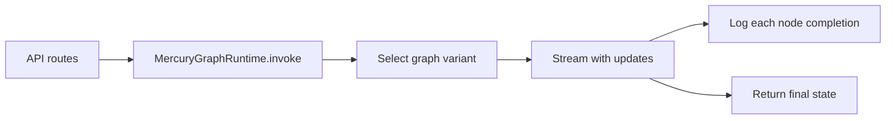

# Plan: Clear per-node graph execution logging (#5)

## Issue summary

[#5](https://github.com/agentic-pantheon/mercury-agentic-wallet/issues/5) asks to **improve logging/debugging** with a system that **tracks each node execution** in the Mercury LangGraph-based agent.

Today, the service logs boundary events only (e.g. `[invoke_request` / `invoke_response](mercury/service/api.py)` via `log_service_event`), but **nothing** records which graph ran or which nodes (`parse_intent`, `resolve_chain`, `resolve_nonce`, etc. from [mercury/graph/agent.py](mercury/graph/agent.py)) actually executed. That makes production debugging opaque.

## Design principles (clarity + safety + readability)

- **One logger namespace** for graph execution, e.g. `mercury.graph`, so operators can filter (`mercury.service` vs graph noise).
- **Structured events** with the same redaction path via `redact_value` (`event`, `request_id`, …). The **handler/formatter** decides presentation: keep a **parsable payload** (JSON string inside the message, or key=value fragments) while making the **terminal line easy to scan** (see below).
- **Human-friendly colored output** when writing to an interactive stderr TTY:
  - **Level colors**: e.g. INFO cyan/green tint, WARNING yellow, ERROR red (exact palette is implementation-defined but must stay legible on light and dark terminals).
  - **Dim** secondary parts (timestamp, logger name) so the **event name** and **request_id** pop.
  - Optional **distinct styling** for graph events (e.g. tag `graph` or logger `mercury.graph`) so node traces stand out next to HTTP/service lines.
  - Respect **[NO_COLOR](https://no-color.org/)** env and `**sys.stderr.isatty()`**: no ANSI escapes when not a TTY or when `NO_COLOR` is set, so Docker/CI/logs remain plain text.
  - **No extra heavy dependencies** unless needed: prefer a small `logging.Formatter` subclass with ANSI escapes; avoid pulling in Rich/loguru unless later justified.
- **Never log raw state payloads** (secrets, large blobs). Log **node name**, **graph variant** (`read` | `erc20` | `native` | `swap`), **which state keys changed** (top-level key names only — strings, not values), and optional **phase** (`start` | `end`).
- **Optional toggle** via settings (e.g. `MERCURY_GRAPH_NODE_LOGGING` on `[MercurySettings](mercury/config.py)`) so production can keep INFO-only at the HTTP layer while enabling graph detail when needed (default can be `true` during rollout or `false` if log volume is a concern — pick one at implementation time).

## Recommended implementation path

**Centralize in `MercuryGraphRuntime.invoke`** ([mercury/graph/runtime.py](mercury/graph/runtime.py)) so both `[POST /v1/mercury/invoke](mercury/service/api.py)` and `[handle_agent_envelope](mercury/service/pan_agentikit_handler.py)` automatically get the same behavior without duplicating calls.

1. **Expose graph variant + intent context**
  Refactor slightly so `_graph_for_state` returns both the compiled graph and a stable string label (e.g. `read`, `erc20_transaction`, `native_transaction`, `swap_transaction`). Log `**graph_run_start`** once per invoke: `request_id`, `graph`, and a safe summary of intent (`kind` from parsed `raw_input`, not full dict).
2. **Observe node execution without editing every node module**
  Prefer **LangGraph streaming** over hand-adding log lines in [mercury/graph/nodes.py](mercury/graph/nodes.py), [nodes_transaction.py](mercury/graph/nodes_transaction.py), etc.  
  - Replace a bare `graph.invoke(state)` with `**graph.stream(state, config=config, stream_mode="updates")`** (exact API to match the repo’s `langgraph` version at implementation time).  
  - For each chunk, log `**graph_node_finished`**: `node`, `graph`, `request_id`, `**state_keys`** = names of keys in that node’s update (not values).  
  - Derive the **final state** from the stream the same way `invoke` would (per LangGraph docs: last full state / last values chunk — verify against installed version so behavior stays identical to today’s `invoke`).
3. `**RunnableConfig` (logs + LangSmith)**

Pass a single `config` dict into `invoke` / `stream` that satisfies both **structured stderr logging** and **[LangSmith tracing](https://docs.langchain.com/langsmith/trace-with-langgraph)** when enabled.

Official LangSmith guidance relevant to Mercury:

- **Tracing LangGraph**: With LangChain/LangGraph runtimes, setting `LANGSMITH_TRACING=true` and `LANGSMITH_API_KEY` is enough for LangSmith to infer tracing when you call the compiled graph normally ([Trace LangGraph applications](https://docs.langchain.com/langsmith/trace-with-langgraph)). Mercury’s nodes are mostly **custom Python**, not LangChain chat models; graph-level and node runs still trace as LangGraph/Pregel runs—**deeper** spans inside a node may need `@traceable` from `langsmith` on selected functions (same doc: “Without LangChain” path).
- **Correlation in LangSmith**: Prefer `**RunnableConfig`** fields that LangSmith already understands ([metadata and tags](https://docs.langchain.com/langsmith/add-metadata-tags), [trace with LangChain](https://docs.langchain.com/langsmith/trace-with-langchain)):
  - `**metadata**`: e.g. `request_id`, `user_id`, `wallet_id`, intent `kind` (strings only; redact if ever expanded).
  - `**tags**`: stable strings such as `mercury`, plus graph variant (`read`, `erc20_transaction`, …).
  - `**run_name**`: optional top-level trace title, e.g. `MercuryGraph.read`.
  - `**configurable.thread_id**`: docs use this for multi-turn threads; mapping `**thread_id` = `request_id**` gives one trace lineage per HTTP/agent request (helps filter in the LangSmith UI).
- **Project / workspace**: `LANGSMITH_PROJECT` (or `tracing_context(project_name=…)` if configuring programmatically); `LANGSMITH_WORKSPACE_ID` when the API key spans multiple workspaces ([trace-with-langchain](https://docs.langchain.com/langsmith/trace-with-langchain)).
- **Deploy / latency**: For serverless-style hosts, docs recommend `**LANGCHAIN_CALLBACKS_BACKGROUND=false`** so traces flush before the worker exits; long-running FastAPI may use `true` to reduce latency (same tracing guides).

**Dual instrumentation (recommended):**

- Keep **structured stderr logs** (`mercury.graph` / `mercury.service`)—payload remains machine-parsable—with **colorized, readable formatting** in TTY dev; plain when `NO_COLOR` or piped.
- **Do not duplicate** LangSmith’s subtree in prose logs beyond high-level events—the UI already shows nodes; correlate both via `request_id` in `metadata`.

**Dependency note:** Tracing works when `langsmith` is installed and env is set; if the project keeps `langgraph` without an explicit `langsmith` dependency, add it as an **optional** dependency or document `pip install langsmith` for tracing-only environments—confirm policy at implementation time.

1. **Helpers + wiring (including colored output)**
  - Add `**log_graph_event`** next to `[log_service_event](mercury/service/logging.py)` (or `[mercury/graph/logging.py](mercury/graph/logging.py)`) sharing serialization + `redact_value`, using `logging.getLogger("mercury.graph")`.  
  - **Extend `[configure_service_logging](mercury/service/logging.py)`** so the root `StreamHandler` uses a `**ColoredMercuryFormatter**`: colors by level, dim timestamp/logger, emphasis on `event` and `request_id`; **no ANSI** when `NO_COLOR` is set or stderr is not a TTY.  
  - Use the **same formatter** for service and graph loggers; differentiate graph lines via the `**mercury.graph`** logger name (and optional short prefix in the format string).  
  - **Tests**: `caplog` with `**NO_COLOR=1`** or assert after stripping ANSI escapes; keep security log tests valid.
2. **Tests**
  - **Integration-style**: `caplog` + run a tiny compiled graph from tests (reuse patterns in [tests/test_graph_smoke.py](tests/test_graph_smoke.py)) expecting log records for each expected node name in order for a fixed `raw_input`.  
  - Unit tests stabilize on message content via `**NO_COLOR=1`** or ANSI stripping where the formatter emits escape codes.
3. **Out of scope (unless you expand the issue)**
  - **OpenTelemetry** export (LangSmith has a separate [OTel guide](https://docs.langchain.com/langsmith/trace-with-opentelemetry)—treat as a follow-on if OTLP routing is required).
  - Log sampling / persisting stdout logs to external systems beyond current patterns.
  - Logging **router** functions as separate “steps” (they are not nodes; stream updates reflect actual nodes only — document that in a short code comment).

## Acceptance criteria

- For a single invoke, logs show **which graph variant** ran and a **time-ordered list of node completions** correlated by `request_id`.
- Structured log messages remain **parsable** and **redaction-safe**; terminal output is **colored and scannable** in dev, **plain** under `NO_COLOR` or non-TTY.
- **No behavior change** to graph outputs vs current `invoke` (same final `MercuryState`).
- **Tests** assert presence/order of node log events for at least one representative path (e.g. read-only balance flow); stabilize assertions with `**NO_COLOR=1`** or ANSI stripping where needed.
- With `LANGSMITH_TRACING` enabled in a dev/staging workspace, a **manual smoke check** shows a trace whose root metadata includes `request_id` / tags (automated assertion optional if API key cannot run in CI).

## Files likely touched

| Area                                                 | File(s)                                                                    |
| ---------------------------------------------------- | -------------------------------------------------------------------------- |
| Runtime + graph selection                            | [mercury/graph/runtime.py](mercury/graph/runtime.py)                       |
| Colored formatter + `log_service_event` presentation | [mercury/service/logging.py](mercury/service/logging.py)                   |
| Graph-specific log helpers (optional split)          | [mercury/graph/logging.py](mercury/graph/logging.py)                       |
| Optional flag + LangSmith-related settings           | [mercury/config.py](mercury/config.py)                                     |
| Optional `langsmith` dependency                      | [pyproject.toml](pyproject.toml) (if you want tracing in default installs) |

**Note:** Implementation should begin with a quick **local read of LangGraph’s `stream` / `stream_mode` return shape** for this repo’s lockfile so final-state extraction matches the library exactly.