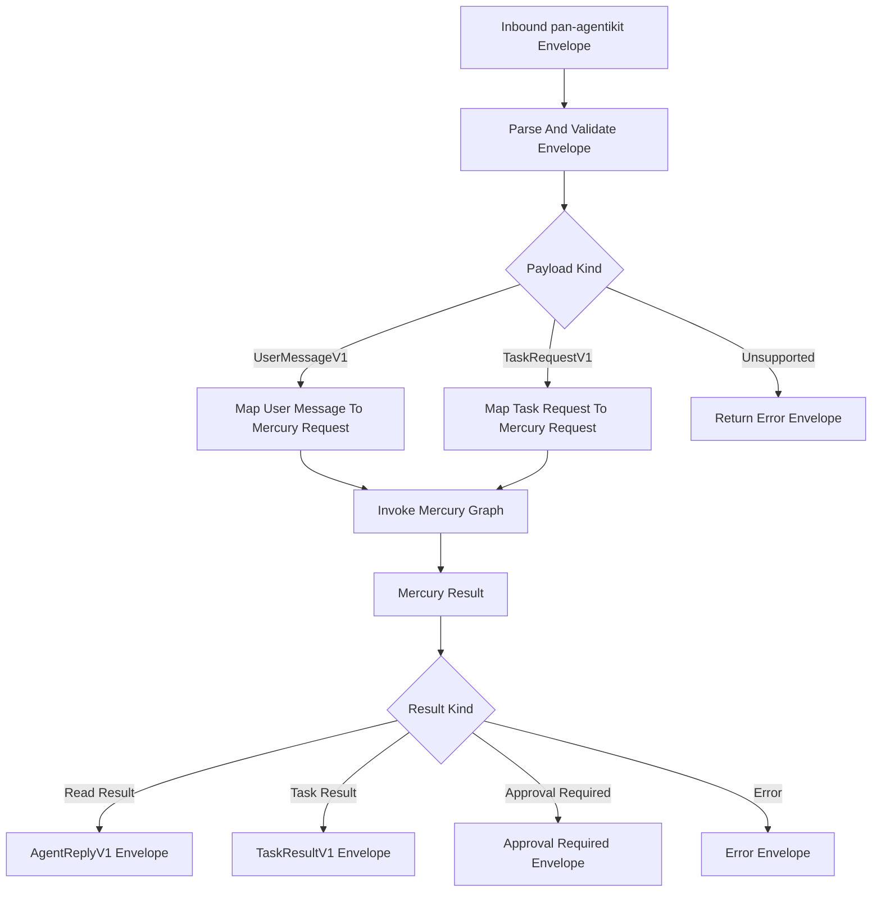

# Mercury Phase 10: pan-agentikit Envelope Adapter

## Goal

Make Mercury compatible with future multi-agent systems built on `pan-agentikit` by adding an `Envelope -> Envelope` HTTP boundary while preserving Mercury’s native API from phase 9.

Mercury should become callable as a specialist wallet agent by a coordinator, Telegram gateway, or other service using pan-agentikit’s common envelope and typed payload conventions.

## Scope

- Add pan-agentikit dependencies or local adapter imports based on package availability.
- Add Mercury-specific payload mapping.
- Add `POST /v1/agent` endpoint compatible with pan-agentikit transport conventions.
- Preserve trace ID, turn ID, roles, parent step ID, artifacts, errors, and idempotency metadata.
- Map inbound task/user payloads into Mercury-native request models.
- Map Mercury results back into typed envelope payloads.
- Add tests using representative envelope JSON.

## Out Of Scope

- No new wallet functionality.
- No swap/provider changes.
- No MCP server exposure.
- No coordinator implementation.
- No production persistence implementation unless pan-agentikit persistence is already available and trivial to wire.
- No Telegram/Slack gateway.

## Proposed Files

- [`mercury/service/pan_agentikit_handler.py`](mercury/service/pan_agentikit_handler.py): envelope adapter and handler.
- [`mercury/service/pan_agentikit_models.py`](mercury/service/pan_agentikit_models.py): Mercury-specific payload models if needed.
- [`mercury/service/api.py`](mercury/service/api.py): add `/v1/agent` route.
- [`mercury/service/dependencies.py`](mercury/service/dependencies.py): handler dependency wiring.
- [`mercury/models/intents.py`](mercury/models/intents.py): mapping helpers if required.
- [`tests/fixtures/pan_agentikit_envelopes.py`](tests/fixtures/pan_agentikit_envelopes.py): sample inbound envelopes.
- [`tests/test_pan_agentikit_adapter.py`](tests/test_pan_agentikit_adapter.py): adapter unit tests.
- [`tests/test_service_pan_agentikit_route.py`](tests/test_service_pan_agentikit_route.py): FastAPI route tests.

## Supported Inbound Payloads

Start with these mappings:

- `UserMessageV1`:
  - natural language wallet request
  - mapped to Mercury graph input with raw message and trace metadata
- `TaskRequestV1`:
  - structured wallet task
  - mapped to Mercury intent when task payload contains known fields

Optional Mercury-specific payloads if needed:

- `WalletTaskRequestV1`
- `WalletTaskResultV1`
- `WalletApprovalRequiredV1`
- `WalletTransactionResultV1`

Prefer built-in pan-agentikit payloads first unless they become too ambiguous.

## Envelope Flow

## Metadata Preservation

The adapter must preserve or derive:

- `trace_id`
- `turn_id`
- `parent_step_id`
- `from_role`
- `to_role`
- `schema_version`
- `artifacts`
- `error`
- idempotency key, either from envelope metadata or task payload

Mercury response envelopes should set:

- `from_role`: `mercury`
- `to_role`: original sender/coordinator where possible
- `turn_id`: incremented or preserved according to pan-agentikit conventions
- `parent_step_id`: inbound step reference when provided

## Implementation Steps

1. Add pan-agentikit package dependency if available, or add an internal compatibility layer behind clearly named imports.
2. Add envelope parsing function:
   - validate outer envelope
   - dispatch payload by kind/version
   - return sanitized error envelope for unsupported payloads
3. Add inbound mapping:
   - `UserMessageV1` to Mercury request
   - `TaskRequestV1` to Mercury request
   - structured wallet task payload to intent model
4. Add graph invocation wrapper that attaches trace/request metadata to graph state.
5. Add outbound mapping:
   - successful read-only result to `AgentReplyV1` or `TaskResultV1`
   - successful transaction result to `TaskResultV1`
   - approval-required result to a typed payload or task result with approval details
   - policy rejection to error/task result
6. Add `/v1/agent` route in FastAPI.
7. Keep `/v1/mercury/invoke` unchanged for native use.
8. Add tests with sample envelopes for:
   - user message read-only request
   - structured task read-only request
   - approval-required transaction response
   - policy rejection
   - unsupported payload
9. Add README section describing Mercury as a pan-agentikit specialist agent.

## Security Requirements

- Envelope parsing must not bypass Mercury policy or approval.
- Structured tasks from other agents are untrusted input.
- Inbound task payloads must pass the same validation as native API requests.
- No envelope response may include secrets, RPC URLs, provider API keys, or private keys.
- Trace metadata must not be treated as authorization.
- Idempotency keys must be preserved for value-moving tasks.

## Testing Plan

- Adapter tests:
  - valid `UserMessageV1` maps to Mercury request
  - valid `TaskRequestV1` maps to Mercury request
  - unsupported payload returns error envelope
  - trace ID and parent step are preserved
  - idempotency key is propagated
- Route tests:
  - `/v1/agent` accepts sample envelope JSON
  - fake graph result maps to response envelope
  - approval-required result maps to approval payload
  - sanitized graph error maps to envelope error
- Security tests:
  - secret-like values are redacted from response
  - private key fields in malicious payload are ignored/rejected
  - value-moving task without idempotency key is rejected or marked invalid

## Acceptance Criteria

- Mercury exposes `POST /v1/agent` for pan-agentikit-compatible calls.
- Mercury native endpoint remains available.
- Inbound pan-agentikit envelopes map into the same graph/policy/signing pipeline as native requests.
- Outbound responses preserve trace metadata.
- Unsupported payloads return structured error envelopes.
- Tests pass with representative envelope fixtures.

## Hand-Off To Phase 11

Phase 11 should harden the whole system with cross-cutting tests:

- registry and tool tests
- policy tests
- signer isolation tests
- graph route tests
- service route tests
- pan-agentikit envelope tests
- optional live integration test gates