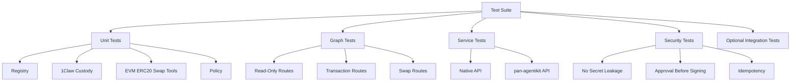

# Mercury Phase 11: Test Hardening And MVP Readiness

## Goal

Harden Mercury’s MVP with comprehensive tests and security regression checks across the full stack: chain registry, 1Claw custody, read-only tools, signer isolation, policy, transaction pipeline, ERC20 flows, swap adapters, FastAPI service, and pan-agentikit adapter.

This phase should not add major features. It should make the existing system reliable, safe, and reviewable.

## Scope

- Review and complete unit test coverage for all phases.
- Add cross-cutting security regression tests.
- Add graph route and state-leakage tests.
- Add service route tests.
- Add pan-agentikit envelope tests.
- Add optional live integration test gates, disabled by default.
- Add CI-ready commands and README test instructions.
- Add fixture cleanup and consistent fake dependency patterns.

## Out Of Scope

- No new wallet features.
- No new chain support beyond Ethereum and Base.
- No new swap providers.
- No production deployment automation.
- No real funds or mainnet write tests.
- No live integration tests enabled by default.

## Proposed Files

- [`tests/conftest.py`](tests/conftest.py): shared fixtures and fake dependencies.
- [`tests/fakes/secret_store.py`](tests/fakes/secret_store.py): fake 1Claw secret store.
- [`tests/fakes/web3.py`](tests/fakes/web3.py): fake Web3/provider helpers.
- [`tests/fakes/signer.py`](tests/fakes/signer.py): fake signer for graph/service tests.
- [`tests/fakes/swap_providers.py`](tests/fakes/swap_providers.py): fake LiFi/CowSwap/Uniswap providers.
- [`tests/security/test_secret_leakage.py`](tests/security/test_secret_leakage.py): private key and secret leakage tests.
- [`tests/security/test_policy_regressions.py`](tests/security/test_policy_regressions.py): policy safety regression tests.
- [`tests/graph/test_full_routes.py`](tests/graph/test_full_routes.py): graph route coverage.
- [`tests/service/test_native_api.py`](tests/service/test_native_api.py): native API tests.
- [`tests/service/test_pan_agentikit_api.py`](tests/service/test_pan_agentikit_api.py): pan-agentikit endpoint tests.
- [`tests/integration/test_readonly_live_optional.py`](tests/integration/test_readonly_live_optional.py): optional read-only live tests gated by env vars.
- [`README.md`](README.md): update testing and safety docs.
- [`pyproject.toml`](pyproject.toml): test markers and lint/type-check commands.

## Test Matrix



## Coverage Areas

### Chain And Config

- Ethereum resolves by name and chain ID.
- Base resolves by name and chain ID.
- Unsupported chains fail clearly.
- Default chain is Ethereum.
- Config does not require real secrets for tests.

### 1Claw Custody

- RPC/API secret resolution works through fake store.
- Missing secrets produce sanitized errors.
- Wallet private-key paths are safe from path traversal.
- Private keys can only be fetched inside signer tests/boundary.

### Read-Only Tools

- Native balances.
- ERC20 metadata.
- ERC20 balances.
- ERC20 allowances.
- Generic contract reads.
- Invalid address handling.
- No live network access by default.

### Signer Boundary

- Address derivation from deterministic fake key.
- Prepared transaction signing.
- Optional EIP-712 signing behavior.
- Private key absent from outputs, exceptions, logs, and graph state.

### Transaction Pipeline

- Ordering: simulate/policy/approval before signing.
- Idempotency prevents duplicate sends.
- Broadcast and monitor behavior with fake providers.
- Policy rejection avoids signing.
- Approval denial avoids signing.

### ERC20 Flows

- Amount parsing.
- Transfer builder.
- Approval builder.
- Insufficient balance handling.
- Unlimited approval rejection by default.
- Unknown spender handling.

### Swap Flows

- LiFi quote/build mocked flow.
- CowSwap normalized quote/order behavior.
- Uniswap normalized quote/build behavior.
- Allowance check before swap execution.
- Swap policy rejects unsafe quote/provider data.

### LangGraph Routes

- Read-only routes.
- ERC20 value-moving routes.
- Swap routes.
- Unsupported intent routes.
- Error state handling.
- No secret leakage in serialized state.

### FastAPI Service

- Health/readiness endpoints.
- Native invoke endpoint.
- Request ID propagation.
- Idempotency key propagation.
- Sanitized errors.
- Approval-required responses.

### pan-agentikit Adapter

- Envelope parsing.
- `UserMessageV1` mapping.
- `TaskRequestV1` mapping.
- Trace metadata preservation.
- Error envelope generation.
- Malicious payload rejection/sanitization.

## Optional Integration Tests

Add markers such as:

- `@pytest.mark.integration`
- `@pytest.mark.live_rpc`
- `@pytest.mark.requires_oneclaw`

Live tests must be disabled unless explicit environment variables are present:

- `MERCURY_RUN_LIVE_TESTS=true`
- `ONECLAW_API_KEY`
- `ONECLAW_VAULT_ID`
- configured read-only RPC secrets

No live test should send transactions or require private keys by default.

## Implementation Steps

1. Audit existing tests from phases 1-10.
2. Add shared fake dependencies in `tests/fakes/`.
3. Normalize all tests to avoid network access by default.
4. Add security leakage assertions for:
   - private keys
   - RPC URLs
   - provider API keys
   - 1Claw credentials
5. Add policy regression tests for:
   - approval before signing
   - unlimited approval rejection
   - chain mismatch rejection
   - unsupported provider rejection
   - expired quote rejection
6. Add full graph route tests.
7. Add service route tests for native and pan-agentikit endpoints.
8. Add optional integration test markers and skip logic.
9. Add lint/type/test commands to README.
10. Run full local quality suite.
11. Fix test gaps or overly brittle abstractions discovered during hardening.

## Security Requirements

- No test fixture may contain a real private key with funds.
- Deterministic fake keys must be documented as test-only.
- Live tests must never broadcast transactions by default.
- Secret redaction tests must cover responses, exceptions, logs if captured, and graph state serialization.
- Approval-before-signing must be enforced by tests, not just documented.
- Idempotency must be tested on the value-moving pipeline.

## Quality Commands

Target commands:

```bash
uv run pytest
uv run ruff check .
uv run ruff format --check .
uv run mypy mercury tests
```

If the project chooses Pyright instead of mypy, replace the type-check command accordingly.

## Acceptance Criteria

- Full unit and service test suite passes without network access.
- Security regression tests prove secrets do not leak through outputs, errors, logs, or graph state.
- Policy tests prove value-moving actions cannot sign before approval.
- Idempotency tests prove duplicate sends are blocked.
- Optional integration tests are gated and skipped by default.
- README documents how to run tests and live read-only checks.
- Mercury MVP is ready for review as a wallet-agent foundation.

## Post-MVP Follow-Ups

- Add more chains through the registry.
- Add production persistence for traces and idempotency.
- Add stronger authentication/authorization at the service boundary.
- Add MCP server exposure for safe read-only and approval-gated wallet tools.
- Add deployment plan once target infrastructure is selected.