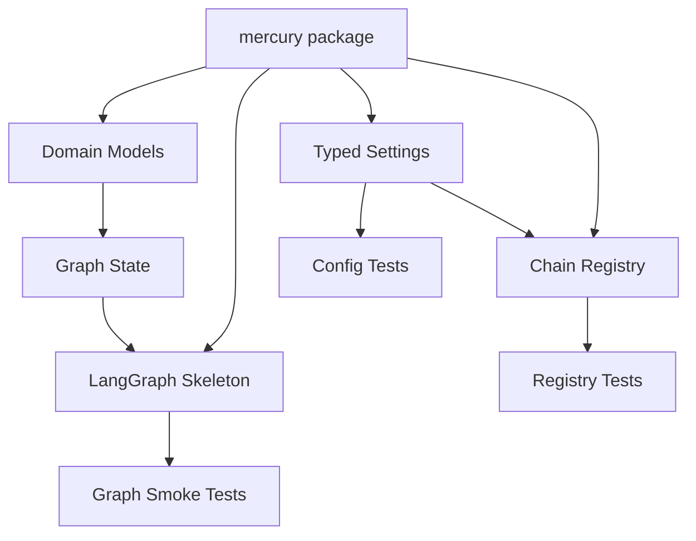
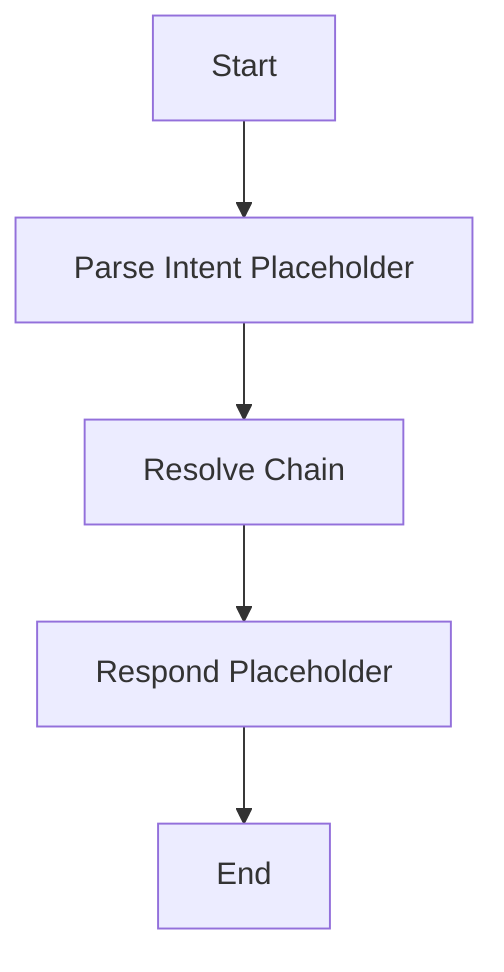

# Mercury Phase 1: Foundation Plan

## Goal

Create the initial Mercury repository foundation: Python project metadata, package layout, typed configuration models, Ethereum/Base chain registry, LangGraph placeholder wiring, and a test baseline.

This phase intentionally avoids private keys, transaction signing, swap integrations, and 1Claw secret retrieval beyond defining interfaces/placeholders.

## Scope

- Create a Python `uv` project for `mercury`.
- Add the initial package structure under [`mercury/`](mercury/).
- Add typed chain configuration for Ethereum and Base.
- Add typed application settings with environment-variable names, but no hardcoded secrets.
- Add initial domain models for wallet intents, chain references, transactions, and policy placeholders.
- Add a minimal LangGraph app skeleton that can compile without performing real wallet actions.
- Add a `langgraph.json` deployment/dev config.
- Add a focused test baseline using `pytest`.
- Add documentation for local setup and the phase 1 boundaries.

## Out Of Scope

- No 1Claw API integration yet.
- No private key retrieval.
- No signing.
- No transaction sending.
- No RPC calls to live chains.
- No LiFi, CowSwap, or Uniswap integration.
- No FastAPI or pan-agentikit HTTP service yet.
- No MCP server exposure yet.

## Proposed Files

- [`pyproject.toml`](pyproject.toml): project metadata, dependencies, lint/test config.
- [`README.md`](README.md): project overview, phase 1 setup, current limitations.
- [`.env.example`](.env.example): non-secret environment variable names.
- [`.gitignore`](.gitignore): Python, uv, env, cache, and local secret exclusions.
- [`langgraph.json`](langgraph.json): LangGraph graph registration.
- [`mercury/__init__.py`](mercury/__init__.py): package marker and version export.
- [`mercury/config.py`](mercury/config.py): typed settings loader.
- [`mercury/chains/__init__.py`](mercury/chains/__init__.py): chain exports.
- [`mercury/chains/registry.py`](mercury/chains/registry.py): Ethereum/Base registry.
- [`mercury/models/__init__.py`](mercury/models/__init__.py): model exports.
- [`mercury/models/chain.py`](mercury/models/chain.py): chain-related Pydantic models.
- [`mercury/models/intents.py`](mercury/models/intents.py): initial wallet intent models.
- [`mercury/models/transactions.py`](mercury/models/transactions.py): unsigned tx and tx reference models.
- [`mercury/models/policy.py`](mercury/models/policy.py): initial policy decision model.
- [`mercury/graph/__init__.py`](mercury/graph/__init__.py): graph exports.
- [`mercury/graph/state.py`](mercury/graph/state.py): LangGraph state type.
- [`mercury/graph/nodes.py`](mercury/graph/nodes.py): placeholder nodes.
- [`mercury/graph/agent.py`](mercury/graph/agent.py): graph construction and exported compiled graph.
- [`tests/test_chain_registry.py`](tests/test_chain_registry.py): Ethereum/Base registry tests.
- [`tests/test_config.py`](tests/test_config.py): settings behavior tests.
- [`tests/test_graph_smoke.py`](tests/test_graph_smoke.py): graph compilation/smoke tests.

## Dependencies

Initial runtime dependencies:

- `langgraph`
- `langchain-core`
- `pydantic`
- `pydantic-settings`
- `typing-extensions`

Initial dev/test dependencies:

- `pytest`
- `pytest-asyncio`
- `ruff`
- `mypy` or `pyright`, depending on preferred local workflow

Defer until later phases:

- `web3`
- `httpx`
- `fastapi`
- 1Claw SDK or HTTP client dependency
- pan-agentikit packages
- swap provider-specific packages

## Foundation Architecture

## Implementation Steps

1. Create project metadata in [`pyproject.toml`](pyproject.toml) using `uv` conventions.
2. Add `.gitignore`, `.env.example`, and README foundation documentation.
3. Create the `mercury` package directories.
4. Implement typed settings in [`mercury/config.py`](mercury/config.py):
   - app name
   - default chain name
   - environment variable names for Ethereum/Base RPC secrets
   - placeholders for future 1Claw settings
5. Implement chain models in [`mercury/models/chain.py`](mercury/models/chain.py):
   - chain name
   - chain ID
   - native symbol
   - RPC secret reference/name
   - block explorer URL
6. Implement [`mercury/chains/registry.py`](mercury/chains/registry.py):
   - Ethereum mainnet, chain ID `1`
   - Base mainnet, chain ID `8453`
   - default chain: `ethereum`
   - lookup by name and chain ID
   - clear errors for unsupported chains
7. Add initial intent and transaction models:
   - read contract intent
   - native balance intent
   - ERC20 balance intent
   - placeholder transaction intent types for future phases
8. Add initial policy model with decisions like `allowed`, `needs_approval`, `rejected`.
9. Add [`mercury/graph/state.py`](mercury/graph/state.py) with a typed graph state containing:
   - messages
   - request ID
   - chain reference
   - intent
   - read result
   - policy decision
   - error
10. Add placeholder graph nodes in [`mercury/graph/nodes.py`](mercury/graph/nodes.py):
   - parse intent placeholder
   - resolve chain placeholder
   - respond placeholder
11. Add [`mercury/graph/agent.py`](mercury/graph/agent.py) with a minimal compiled LangGraph.
12. Add [`langgraph.json`](langgraph.json) pointing to the compiled graph export.
13. Add tests for registry behavior, config defaults, and graph compilation.
14. Run the test suite and static checks.

## LangGraph Phase 1 Skeleton

This is intentionally small. It establishes graph wiring without pretending to execute blockchain operations before the custody and tool layers exist.

## Security Requirements

- Do not add real secrets to the repository.
- Do not add private-key handling in this phase.
- Do not expose any `get_secret` or `get_private_key` tool.
- Use only secret references or environment-variable names in config.
- `.env` must be ignored.
- `.env.example` must contain placeholders only.

## Testing Plan

- Chain registry tests:
  - resolves `ethereum` by name
  - resolves `base` by name
  - resolves chain ID `1`
  - resolves chain ID `8453`
  - raises clear error for unsupported chain
  - default chain is Ethereum
- Config tests:
  - default settings load without secrets
  - default chain is Ethereum
  - environment variable names are represented as references, not secret values
- Graph tests:
  - graph imports successfully
  - graph compiles successfully
  - basic invocation returns a placeholder response

## Acceptance Criteria

- `uv sync` succeeds.
- `uv run pytest` succeeds.
- `uv run ruff check .` succeeds.
- The package imports as `mercury`.
- Ethereum and Base are available in the chain registry.
- The default chain is Ethereum.
- The LangGraph skeleton compiles and has a smoke test.
- No live RPC calls are made.
- No private keys or real secrets are added.
- README clearly states Phase 1 does not sign or send transactions.

## Hand-Off To Phase 2

Phase 2 should build on this foundation by adding read-only wallet tools:

- Resolve RPC URLs through the future 1Claw adapter.
- Add `web3.py`.
- Implement native balance reads.
- Implement ERC20 balance and allowance reads.
- Implement safe contract read calls.
- Expand the LangGraph read-only routing path.