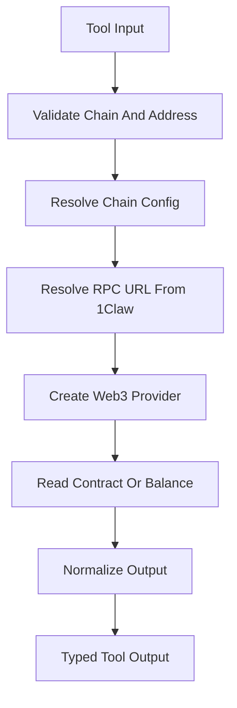

# Mercury Phase 3: Read-Only EVM And ERC20 Tools

## Goal

Build Mercury’s first real blockchain capabilities: read-only EVM and ERC20 tools for Ethereum and Base. These tools should be typed, testable, LangChain-compatible, and safe to expose to the LangGraph agent.

## Scope

- Add `web3.py` dependency.
- Add Web3 provider construction using RPC URLs resolved through the phase 2 1Claw custody wrapper.
- Implement native balance reads.
- Implement ERC20 `balanceOf`, `allowance`, `decimals`, `symbol`, and `name` reads.
- Implement generic contract read calls for known ABI fragments.
- Add typed tool input/output schemas.
- Add unit tests with mocked Web3/provider behavior.
- Add optional integration-test structure, but keep it disabled by default.

## Out Of Scope

- No private-key retrieval.
- No signing.
- No transaction sending.
- No approvals or transfers.
- No swap provider integrations.
- No policy engine beyond basic validation of read inputs.
- No user-facing FastAPI service yet.

## Proposed Files

- [`mercury/providers/web3.py`](mercury/providers/web3.py): Web3 provider factory using chain registry and 1Claw RPC resolution.
- [`mercury/providers/__init__.py`](mercury/providers/__init__.py): provider exports.
- [`mercury/tools/evm.py`](mercury/tools/evm.py): native balance and generic contract read tools.
- [`mercury/tools/erc20.py`](mercury/tools/erc20.py): ERC20 read-only tools.
- [`mercury/tools/schemas.py`](mercury/tools/schemas.py): shared Pydantic tool schemas if useful.
- [`mercury/abi/erc20.py`](mercury/abi/erc20.py): minimal ERC20 ABI fragments.
- [`mercury/abi/__init__.py`](mercury/abi/__init__.py): ABI exports.
- [`mercury/models/addresses.py`](mercury/models/addresses.py): EVM address validation helpers/models.
- [`mercury/models/amounts.py`](mercury/models/amounts.py): token amount formatting helpers/models.
- [`tests/test_web3_provider.py`](tests/test_web3_provider.py): provider factory tests with fake secret store.
- [`tests/test_evm_read_tools.py`](tests/test_evm_read_tools.py): native balance and contract read tests.
- [`tests/test_erc20_read_tools.py`](tests/test_erc20_read_tools.py): ERC20 metadata, balance, and allowance tests.

## Tool Surface To Build

- `get_native_balance(chain, wallet_address)`
- `get_erc20_balance(chain, token_address, wallet_address)`
- `get_erc20_allowance(chain, token_address, owner_address, spender_address)`
- `get_erc20_metadata(chain, token_address)`
- `read_contract(chain, contract_address, abi_fragment, function_name, args)`

## Data Flow

## Implementation Steps

1. Add `web3` as a project dependency.
2. Add EVM address validation helpers:
   - reject empty addresses
   - normalize checksum addresses where possible
   - return sanitized errors for invalid addresses
3. Add minimal ERC20 ABI fragments for:
   - `balanceOf(address)`
   - `allowance(address,address)`
   - `decimals()`
   - `symbol()`
   - `name()`
4. Add `Web3ProviderFactory`:
   - accepts a `SecretStore`
   - resolves RPC URL using `resolve_rpc_url`
   - returns chain-specific Web3 provider/client
5. Implement `get_native_balance`:
   - accepts chain and wallet address
   - returns raw wei and formatted native amount
6. Implement `get_erc20_metadata`:
   - returns decimals, symbol, and name where available
   - handles optional missing symbol/name gracefully
7. Implement `get_erc20_balance`:
   - fetch metadata
   - returns raw integer balance and formatted decimal string
8. Implement `get_erc20_allowance`:
   - fetch metadata
   - returns raw integer allowance and formatted decimal string
9. Implement `read_contract`:
   - accepts an ABI fragment and function name
   - supports read-only `eth_call` functions only
   - rejects attempts to call non-view-like functions if ABI mutability is provided
10. Wrap functions as LangChain tools with typed Pydantic schemas.
11. Add tests with mocked Web3 contracts and fake 1Claw RPC secrets.
12. Document examples in README.

## Validation Rules

- Every tool requires an explicit chain name, but graph defaults can still supply `ethereum` later.
- Chain must exist in the registry.
- Addresses must be valid EVM addresses.
- ERC20 decimals must be bounded to a reasonable range.
- Contract read calls must not mutate state.
- Tool outputs must not include RPC URLs or 1Claw secret values.

## Security Requirements

- No private-key access.
- No signing-capable Web3 account is created.
- No transaction-building side effects.
- No logs containing RPC URLs unless explicitly redacted.
- All 1Claw access is limited to RPC/API secret retrieval from phase 2.

## Testing Plan

- Provider factory:
  - resolves Ethereum RPC through fake 1Claw store
  - resolves Base RPC through fake 1Claw store
  - fails cleanly when RPC secret is missing
- Address validation:
  - accepts valid checksum/lowercase addresses
  - rejects malformed addresses
- Native balance:
  - returns raw wei and formatted ETH
- ERC20 metadata:
  - returns decimals/symbol/name
  - handles missing optional metadata
- ERC20 balance:
  - calls `balanceOf`
  - formats using decimals
- ERC20 allowance:
  - calls `allowance`
  - formats using decimals
- Generic contract read:
  - calls the requested view function
  - rejects mutating ABI entries when detectable

## Acceptance Criteria

- `uv run pytest tests/test_web3_provider.py tests/test_evm_read_tools.py tests/test_erc20_read_tools.py` succeeds.
- Read-only tools are importable from `mercury.tools`.
- Tools can be used as LangChain tools with typed schemas.
- Ethereum and Base both work through the same provider abstraction.
- No private-key, signing, approval, transfer, or swap code is introduced.
- No test requires live network access by default.

## Hand-Off To Phase 4

Phase 4 should wire these read-only tools into the LangGraph flow:

- Parse read-only wallet intents.
- Resolve default chain when omitted.
- Route to the correct read tool.
- Return normalized agent responses.
- Add graph route tests for balance, allowance, and contract read intents.