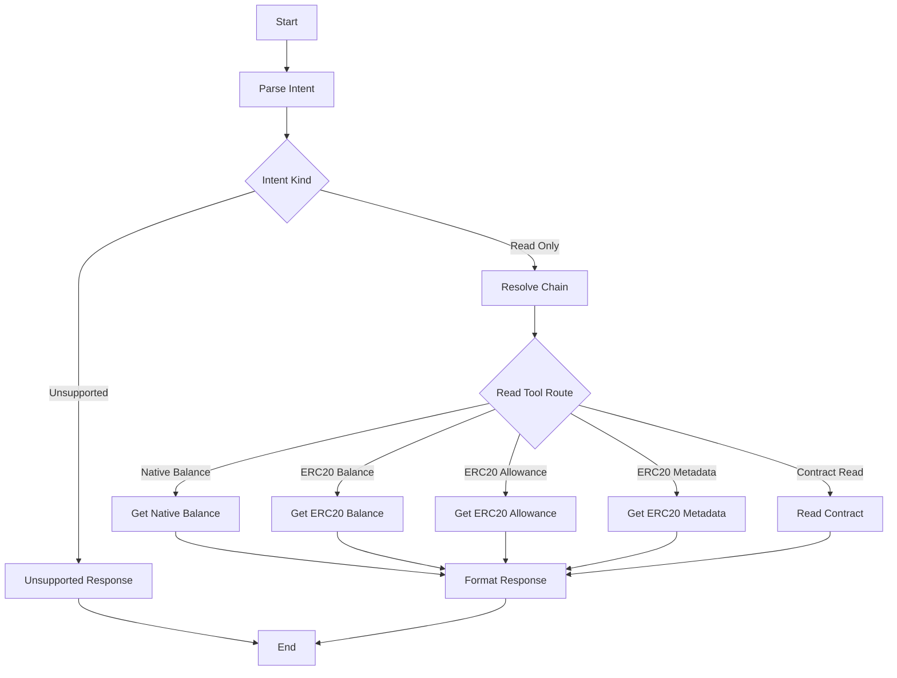

# Mercury Phase 4: LangGraph Read-Only Path

## Goal

Build Mercury’s first useful LangGraph workflow: accept a user or structured request, classify it as a read-only wallet intent, resolve the chain, call the correct read-only tool, and return a normalized response.

## Scope

- Expand graph state for read-only execution.
- Implement intent parsing for native balance, ERC20 balance, ERC20 allowance, ERC20 metadata, and contract reads.
- Implement chain resolution with Ethereum as the default and Base as an explicit supported chain.
- Add conditional routing for read-only intents.
- Connect phase 3 tools to graph nodes.
- Add response formatting.
- Add tests for graph routing and read-only execution with fake tools/providers.

## Out Of Scope

- No transaction building.
- No private-key retrieval.
- No signing.
- No human approval.
- No swaps.
- No FastAPI service boundary.
- No pan-agentikit envelope adapter yet.

## Proposed Files

- [`mercury/graph/state.py`](mercury/graph/state.py): read-only graph state fields.
- [`mercury/graph/intents.py`](mercury/graph/intents.py): intent parser and classification helpers.
- [`mercury/graph/nodes.py`](mercury/graph/nodes.py): read-only nodes.
- [`mercury/graph/router.py`](mercury/graph/router.py): conditional routing functions.
- [`mercury/graph/responses.py`](mercury/graph/responses.py): normalized response formatting.
- [`mercury/graph/agent.py`](mercury/graph/agent.py): updated graph construction.
- [`mercury/tools/registry.py`](mercury/tools/registry.py): read-only tool registry for graph use.
- [`tests/test_graph_readonly_routes.py`](tests/test_graph_readonly_routes.py): route tests.
- [`tests/test_graph_readonly_execution.py`](tests/test_graph_readonly_execution.py): fake-tool execution tests.

## Graph Flow

## Intent Inputs To Support

Structured intent models should support:

- `native_balance`: wallet address, optional chain.
- `erc20_balance`: token address, wallet address, optional chain.
- `erc20_allowance`: token address, owner address, spender address, optional chain.
- `erc20_metadata`: token address, optional chain.
- `contract_read`: contract address, ABI fragment, function name, args, optional chain.

Natural language parsing can be minimal in this phase. Prefer structured inputs first, with a simple parser for obvious text prompts only if already available from phase 1.

## Implementation Steps

1. Extend graph state with:
   - raw input
   - parsed intent
   - chain name/config
   - selected tool name
   - tool input
   - tool result
   - response text
   - error
2. Implement intent parsing from structured dictionaries.
3. Add minimal text-to-intent handling only for simple examples like balance checks, if low-risk.
4. Implement `resolve_chain_node`:
   - default missing chain to Ethereum
   - validate supported chain names
   - attach `ChainConfig` to state
5. Implement read-only router:
   - native balance route
   - ERC20 balance route
   - ERC20 allowance route
   - ERC20 metadata route
   - contract read route
6. Implement one node per read-only tool or a generic `execute_read_tool_node` if the tool registry is clean.
7. Implement response formatter with consistent outputs:
   - chain name
   - address/token/spender where relevant
   - raw result where useful
   - formatted amount where useful
8. Add error formatting that avoids leaking secret values or RPC URLs.
9. Update `agent.py` to compile the read-only graph.
10. Add graph tests using fake tools so tests do not require network access.
11. Add README examples for read-only graph invocations.

## Error Behavior

- Unsupported intent: return a clear unsupported-operation response.
- Unsupported chain: return a clear chain error.
- Invalid address: return validation error.
- Tool failure: return sanitized tool error.
- Missing RPC secret: return sanitized configuration error.

## Security Requirements

- No graph path may fetch wallet private keys.
- No graph path may build or send transactions.
- Tool outputs must not include RPC URLs or 1Claw secret values.
- Errors must be sanitized before response formatting.
- Unsupported value-moving intents must not be partially executed.

## Testing Plan

- Route tests:
  - native balance intent routes to native balance node
  - ERC20 balance intent routes to ERC20 balance node
  - allowance intent routes to allowance node
  - metadata intent routes to metadata node
  - contract read intent routes to contract read node
  - unsupported intent routes to unsupported response
- Chain tests:
  - missing chain defaults to Ethereum
  - Base resolves when specified
  - unsupported chain is rejected
- Execution tests:
  - fake native balance tool result is formatted correctly
  - fake ERC20 balance result is formatted correctly
  - fake tool error becomes sanitized response

## Acceptance Criteria

- The graph compiles successfully.
- The graph can execute structured read-only intents without network access in tests.
- Ethereum is the default chain.
- Base can be selected explicitly.
- Unsupported value-moving requests are rejected or marked unsupported.
- No private-key, signing, transaction-building, or swap code is introduced.
- Tests pass for read-only routing and response formatting.

## Hand-Off To Phase 5

Phase 5 should introduce the signing boundary separately:

- Wallet ID to 1Claw private-key path resolution.
- In-memory signing only inside custody code.
- Tests proving private keys never enter graph state, logs, or LLM-facing tool outputs.