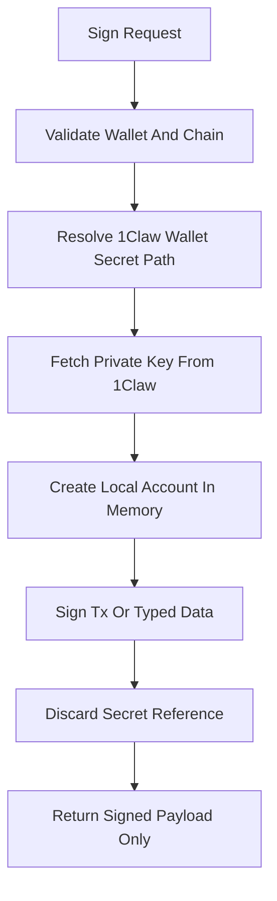

# Mercury Phase 5: 1Claw Signer Boundary

## Goal

Implement the isolated signer boundary for Mercury. Wallet private keys must be fetched only from 1Claw, used only inside custody code, never exposed to the LLM, never stored in graph state, and never returned from tools.

This phase creates signing primitives only. Broadcasting and full transaction execution remain for phase 6.

## Scope

- Add wallet identity models.
- Add wallet secret path conventions.
- Implement 1Claw private-key retrieval inside the signer boundary.
- Derive wallet address from 1Claw-managed key.
- Sign EVM legacy/EIP-1559 transaction payloads in memory.
- Sign EIP-712 typed data for future CowSwap/order flows if practical.
- Add redaction helpers for logs/errors/tests.
- Add tests proving private keys are isolated from graph state and public outputs.

## Out Of Scope

- No transaction broadcasting.
- No nonce management beyond accepting nonce in sign input.
- No gas estimation.
- No policy engine.
- No human approval.
- No ERC20 transfer/approval builders.
- No swap integrations.
- No FastAPI service boundary.

## Proposed Files

- [`mercury/custody/signer.py`](mercury/custody/signer.py): signer boundary implementation.
- [`mercury/custody/wallets.py`](mercury/custody/wallets.py): wallet ID and secret path resolution.
- [`mercury/custody/redaction.py`](mercury/custody/redaction.py): secret redaction helpers.
- [`mercury/custody/errors.py`](mercury/custody/errors.py): signer-specific sanitized errors.
- [`mercury/models/wallets.py`](mercury/models/wallets.py): wallet reference and address models.
- [`mercury/models/signing.py`](mercury/models/signing.py): sign request/result models.
- [`mercury/models/transactions.py`](mercury/models/transactions.py): unsigned/signed transaction models if not already present.
- [`tests/test_wallet_secret_paths.py`](tests/test_wallet_secret_paths.py): wallet ID to 1Claw path tests.
- [`tests/test_signer_boundary.py`](tests/test_signer_boundary.py): signing behavior with fake 1Claw keys.
- [`tests/test_secret_redaction.py`](tests/test_secret_redaction.py): redaction and leakage tests.

## 1Claw Wallet Secret Paths

Use this convention:

- `mercury/wallets/{wallet_id}/private_key`

Optional future paths:

- `mercury/wallets/{wallet_id}/metadata`
- `mercury/wallets/{wallet_id}/allowed_chains`
- `mercury/wallets/{wallet_id}/policy`

Only the signer boundary may resolve `private_key` paths.

## Signing Boundary Data Flow

## Public Interface

Expose custody methods like:

- `get_wallet_address(wallet_id: str) -> WalletAddressResult`
- `sign_transaction(request: SignTransactionRequest) -> SignedTransactionResult`
- `sign_typed_data(request: SignTypedDataRequest) -> SignedTypedDataResult`

Do not expose:

- `get_private_key`
- `get_secret`
- `export_wallet`
- any method returning raw key material

## Implementation Steps

1. Add `WalletRef` model with `wallet_id` and optional expected address.
2. Add wallet ID validation:
   - non-empty
   - safe path characters only
   - no path traversal
3. Add `wallet_private_key_path(wallet_id)` helper.
4. Add signer dependency on the `SecretStore` protocol from phase 2.
5. Add private-key normalization inside signer only:
   - accept `0x` prefixed value
   - accept unprefixed hex if required
   - reject invalid lengths/formats
6. Add address derivation from private key.
7. Add `get_wallet_address` that returns only the derived public address.
8. Add `sign_transaction`:
   - accepts fully prepared transaction dict/model
   - validates chain ID exists and matches intent
   - signs in memory
   - returns raw signed transaction bytes/hex and derived address
9. Add `sign_typed_data` if dependency support is stable; otherwise define models and defer implementation explicitly.
10. Add redaction helpers for exceptions and debug strings.
11. Ensure signer errors never include secret value, raw tx with key material, or 1Claw credentials.
12. Add tests with deterministic fake private key fixtures.
13. Add leakage tests that inspect outputs, exceptions, and graph state helper serialization.

## Security Requirements

- Private keys are fetched only inside [`mercury/custody/signer.py`](mercury/custody/signer.py).
- Private keys are never placed into LangGraph state.
- Private keys are never returned from any public method.
- Private keys are never included in exceptions or logs.
- Wallet IDs cannot perform path traversal in 1Claw secret paths.
- The signer accepts only prepared payloads; it does not decide policy.
- The signer does not broadcast transactions.

## Testing Plan

- Wallet path tests:
  - valid wallet ID maps to expected 1Claw path
  - invalid wallet ID is rejected
  - path traversal strings are rejected
- Address tests:
  - deterministic test private key derives expected EVM address
  - result does not include private key
- Transaction signing tests:
  - valid unsigned transaction signs successfully
  - chain ID mismatch is rejected
  - malformed private key is rejected with sanitized error
- Typed data tests:
  - valid typed data signs if implemented
  - otherwise tests assert explicit not-yet-supported behavior
- Leakage tests:
  - private key absent from returned models
  - private key absent from exception messages
  - private key absent from serialized graph state samples

## Acceptance Criteria

- Mercury can derive a wallet address from a 1Claw-managed fake private key in tests.
- Mercury can sign a prepared EVM transaction in memory using a fake 1Claw store.
- No private key appears in public return values, graph state, exceptions, or test snapshots.
- No transaction broadcasting exists yet.
- All signer tests pass without network access.

## Hand-Off To Phase 6

Phase 6 should build the transaction execution pipeline around this signer:

- transaction preparation inputs
- nonce lookup
- gas estimation
- simulation
- policy checks
- approval interrupt
- signing through this boundary
- broadcast
- receipt monitoring