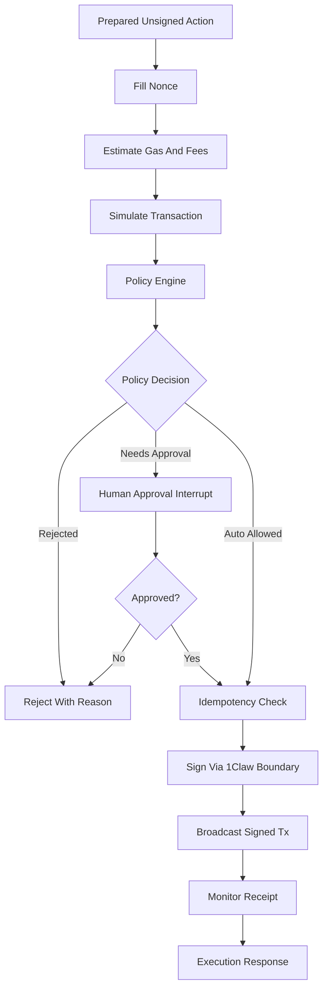

# Mercury Phase 6: Transaction Pipeline

## Goal

Implement Mercury’s generic transaction execution pipeline for prepared EVM transactions. This phase connects transaction preparation, gas/nonce handling, simulation, policy checks, human approval, 1Claw-backed signing, broadcasting, and receipt monitoring.

This phase should remain action-agnostic. ERC20-specific transfer/approval builders come in phase 7; swap builders come in phase 8.

## Scope

- Add transaction preparation and execution models.
- Add nonce lookup.
- Add gas estimation and EIP-1559 fee filling.
- Add transaction simulation/preflight checks.
- Add initial policy engine.
- Add mandatory human approval interrupt before signing.
- Use the phase 5 signer boundary to sign prepared transactions.
- Broadcast signed transactions.
- Monitor receipts.
- Add idempotency key support to avoid duplicate sends.
- Add graph nodes for the value-moving pipeline.

## Out Of Scope

- No ERC20 transfer/approval builder logic yet.
- No swap provider integration.
- No protocol deposit adapters.
- No pan-agentikit envelope adapter yet.
- No auto-approval rules beyond a placeholder path; MVP requires approval for value-moving actions.

## Proposed Files

- [`mercury/models/execution.py`](mercury/models/execution.py): execution request/result models.
- [`mercury/models/gas.py`](mercury/models/gas.py): gas and fee models.
- [`mercury/models/simulation.py`](mercury/models/simulation.py): simulation result models.
- [`mercury/models/approval.py`](mercury/models/approval.py): approval request/result models.
- [`mercury/policy/risk.py`](mercury/policy/risk.py): initial policy engine.
- [`mercury/policy/rules.py`](mercury/policy/rules.py): reusable policy rules.
- [`mercury/policy/idempotency.py`](mercury/policy/idempotency.py): in-memory idempotency store interface/implementation.
- [`mercury/tools/transactions.py`](mercury/tools/transactions.py): estimate, simulate, broadcast, monitor tools.
- [`mercury/graph/nodes_transaction.py`](mercury/graph/nodes_transaction.py): transaction pipeline nodes.
- [`mercury/graph/router.py`](mercury/graph/router.py): value-moving route additions.
- [`mercury/graph/state.py`](mercury/graph/state.py): transaction state fields.
- [`tests/test_transaction_pipeline.py`](tests/test_transaction_pipeline.py): pipeline tests with fake dependencies.
- [`tests/test_policy_engine.py`](tests/test_policy_engine.py): policy decision tests.
- [`tests/test_idempotency.py`](tests/test_idempotency.py): duplicate-send prevention tests.

## Transaction Pipeline Graph

## Pipeline Inputs

The pipeline should accept a prepared transaction model with:

- `wallet_id`
- `chain`
- `to`
- `value_wei`
- `data`
- optional `nonce`
- optional gas fields
- action metadata for policy decisions
- idempotency key

## Pipeline Outputs

Return a normalized execution result with:

- chain name
- wallet address
- transaction hash
- status: pending, confirmed, failed, rejected, approval_denied
- block number if available
- gas used if available
- policy decision summary
- sanitized error if failed

Never return private key material or raw 1Claw secrets.

## Implementation Steps

1. Add transaction execution models.
2. Add `PreparedTransaction` and `ExecutableTransaction` distinction.
3. Add nonce lookup using Web3 provider from phase 3.
4. Add gas estimation for prepared transactions.
5. Add EIP-1559 fee population:
   - `maxFeePerGas`
   - `maxPriorityFeePerGas`
   - fallback behavior for chains/providers that need legacy gas price
6. Add simulation/preflight:
   - `eth_call` against transaction payload
   - estimate gas validation
   - chain ID validation
   - balance sufficiency check where possible
7. Add policy engine with initial decisions:
   - `rejected`
   - `needs_approval`
   - `allowed`
8. Configure MVP policy to require approval for every value-moving action.
9. Add human approval node as a LangGraph interrupt/placeholder depending on available runtime.
10. Add idempotency interface:
   - check key before signing/broadcasting
   - mark in-flight before broadcast
   - mark completed after receipt
11. Connect signer boundary from phase 5.
12. Implement broadcast using Web3 `send_raw_transaction`.
13. Implement receipt monitoring with configurable timeout and confirmations.
14. Add graph transaction nodes and route stubs.
15. Add fake dependency tests for every stage.

## Policy Rules For This Phase

- Reject unsupported chain.
- Reject missing wallet ID.
- Reject invalid recipient address.
- Reject missing idempotency key for value-moving operations.
- Require human approval for all value-moving operations.
- Reject transactions whose `chain_id` does not match resolved chain.
- Reject simulation failure.
- Reject estimated gas above configured maximum if configured.

## Security Requirements

- Signing happens only after policy and approval.
- Signing uses only the phase 5 signer boundary.
- The graph state may store signed transaction hex temporarily only if needed for broadcast, but never stores private keys.
- Idempotency check must happen before signing/broadcasting to reduce duplicate-send risk.
- Errors must be sanitized.
- Approval prompts must show human-readable transaction details before signing.

## Testing Plan

- Pipeline ordering:
  - nonce/gas/simulation occur before policy
  - policy/approval occur before signing
  - signing occurs before broadcast
- Policy tests:
  - every value-moving transaction needs approval by default
  - chain mismatch rejected
  - invalid recipient rejected
  - simulation failure rejected
- Idempotency tests:
  - first request proceeds
  - duplicate in-flight request is blocked
  - completed request returns existing status or duplicate error
- Broadcast/monitor tests:
  - fake broadcast returns tx hash
  - fake receipt monitor returns confirmed result
  - timeout returns pending/timeout status
- Secret isolation tests:
  - no private key in execution result
  - no private key in errors

## Acceptance Criteria

- A prepared fake EVM transaction can flow through the graph pipeline using fake dependencies.
- The pipeline requires approval before signing.
- The signer boundary is called only after policy and approval pass.
- Broadcast and receipt monitoring are implemented behind fakeable interfaces.
- Idempotency prevents duplicate sends in tests.
- No ERC20-specific builders or swap integrations are introduced.

## Hand-Off To Phase 7

Phase 7 should add action builders that feed this generic pipeline:

- ERC20 transfer transaction builder.
- ERC20 approval transaction builder.
- Allowance checks.
- Approval-specific policy rules such as rejecting unlimited approvals by default.