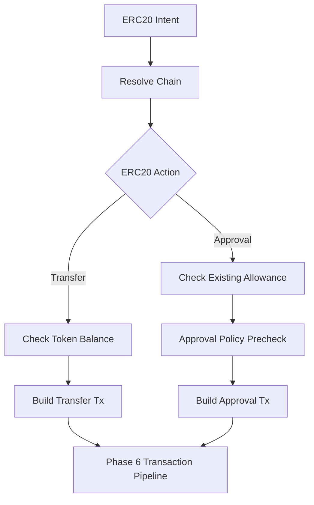

# Mercury Phase 7: ERC20 Transfer And Approval Flows

## Goal

Add ERC20 transaction capabilities to Mercury by building ERC20 transfer and approval transactions that feed into the generic phase 6 transaction pipeline.

This phase makes Mercury capable of preparing, validating, approving, signing, broadcasting, and monitoring ERC20 transfers and approvals through the existing policy and signing flow.

## Scope

- Add ERC20 transfer intent model.
- Add ERC20 approval intent model.
- Add token amount parsing and decimal conversion.
- Build ERC20 `transfer(address,uint256)` transactions.
- Build ERC20 `approve(address,uint256)` transactions.
- Add allowance pre-checks.
- Add balance pre-checks for transfers.
- Add approval-specific policy rules.
- Add LangGraph routes from ERC20 intents into the transaction pipeline.
- Add tests with mocked contract calls and fake transaction pipeline dependencies.

## Out Of Scope

- No swaps.
- No LiFi/CowSwap/Uniswap integration.
- No token registry beyond minimal validation helpers.
- No protocol deposits.
- No pan-agentikit service boundary.
- No automatic low-risk approvals; MVP still requires approval before signing.

## Proposed Files

- [`mercury/models/erc20.py`](mercury/models/erc20.py): ERC20 token, amount, transfer, and approval models.
- [`mercury/models/intents.py`](mercury/models/intents.py): ERC20 transfer/approval intent additions.
- [`mercury/tools/erc20_transactions.py`](mercury/tools/erc20_transactions.py): transfer and approval transaction builders.
- [`mercury/tools/erc20.py`](mercury/tools/erc20.py): reuse/extend read helpers for decimals, balance, allowance.
- [`mercury/policy/rules.py`](mercury/policy/rules.py): ERC20-specific risk rules.
- [`mercury/graph/nodes_erc20.py`](mercury/graph/nodes_erc20.py): ERC20 builder nodes.
- [`mercury/graph/router.py`](mercury/graph/router.py): ERC20 value-moving route additions.
- [`tests/test_erc20_amounts.py`](tests/test_erc20_amounts.py): decimal parsing/formatting tests.
- [`tests/test_erc20_transaction_builders.py`](tests/test_erc20_transaction_builders.py): transfer/approval builder tests.
- [`tests/test_erc20_policy.py`](tests/test_erc20_policy.py): approval/transfer policy tests.
- [`tests/test_graph_erc20_routes.py`](tests/test_graph_erc20_routes.py): graph route tests.

## ERC20 Graph Flow

## Tool Surface To Build

- `prepare_erc20_transfer(chain, wallet_id, token_address, recipient_address, amount)`
- `prepare_erc20_approval(chain, wallet_id, token_address, spender_address, amount)`
- `check_erc20_transfer_preconditions(chain, token_address, owner_address, amount)`
- `check_erc20_approval_preconditions(chain, token_address, owner_address, spender_address, amount)`

These tools prepare transactions. They do not sign directly. Signing still happens only in the phase 6 pipeline through the phase 5 signer boundary.

## Implementation Steps

1. Add ERC20 amount model:
   - human amount string
   - decimals
   - raw integer amount
   - formatting helpers
2. Add ERC20 transfer intent:
   - chain
   - wallet ID
   - token address
   - recipient address
   - amount
   - optional idempotency key
3. Add ERC20 approval intent:
   - chain
   - wallet ID
   - token address
   - spender address
   - amount
   - optional idempotency key
4. Add token metadata lookup reuse from phase 3.
5. Add wallet address lookup through phase 5 signer boundary for the sender address.
6. Implement transfer preconditions:
   - valid token address
   - valid recipient address
   - positive amount
   - sufficient token balance
7. Implement approval preconditions:
   - valid token address
   - valid spender address
   - positive or zero amount depending on allowance reset support
   - current allowance check
8. Implement `transfer` transaction builder:
   - `to`: token contract
   - `data`: encoded `transfer(recipient, raw_amount)`
   - `value`: `0`
   - action metadata for policy
9. Implement `approve` transaction builder:
   - `to`: token contract
   - `data`: encoded `approve(spender, raw_amount)`
   - `value`: `0`
   - action metadata for policy
10. Add ERC20-specific policy rules:
   - reject unlimited approvals by default
   - flag unknown spender for approval
   - reject self-transfer if configured
   - reject zero-address recipient/spender
   - require approval for all ERC20 actions in MVP
11. Add graph nodes that convert ERC20 intents into prepared transactions.
12. Route prepared ERC20 transactions into the phase 6 transaction pipeline.
13. Add tests with mocked Web3 contract encoding and fake balances/allowances.

## Policy Rules For This Phase

- Transfers require sufficient ERC20 balance.
- Transfers reject zero address recipients.
- Approvals reject zero address spenders.
- Unlimited approvals are rejected by default unless explicitly represented as a high-risk approval override.
- Approval spender should be included in the human approval prompt.
- Token address, spender, recipient, amount, chain, and wallet address must be visible in approval details.

## Security Requirements

- ERC20 builders never fetch private keys.
- ERC20 builders never sign or broadcast directly.
- Sender address comes from wallet ID via public address derivation only.
- Human approval must show spender and token details for approvals.
- Unknown spender approvals must be high-risk or rejected.
- No secret values appear in transaction metadata or responses.

## Testing Plan

- Amount tests:
  - parse `1.5` USDC with 6 decimals to `1500000`
  - reject negative amount
  - reject too many decimal places
- Transfer builder tests:
  - builds correct token contract call
  - rejects insufficient balance
  - rejects invalid recipient
- Approval builder tests:
  - builds correct approval call
  - rejects invalid spender
  - rejects unlimited approval by default
  - handles allowance already sufficient
- Policy tests:
  - ERC20 transfer requires approval
  - ERC20 approval requires approval
  - unlimited approval rejected
  - unknown spender flagged/rejected
- Graph tests:
  - transfer intent routes to transfer builder then pipeline
  - approval intent routes to approval builder then pipeline

## Acceptance Criteria

- Mercury can prepare ERC20 transfer transactions for Ethereum and Base.
- Mercury can prepare ERC20 approval transactions for Ethereum and Base.
- Prepared ERC20 transactions flow into the generic transaction pipeline.
- All ERC20 value-moving actions require approval before signing.
- Unlimited approvals are rejected by default.
- No ERC20 builder accesses private keys or signs directly.
- Tests pass without live network access by default.

## Hand-Off To Phase 8

Phase 8 should add swap integrations that reuse this ERC20 foundation:

- allowance checks before swaps
- approval preparation when required
- LiFi quote and transaction building first
- CowSwap order support
- Uniswap quote/build support