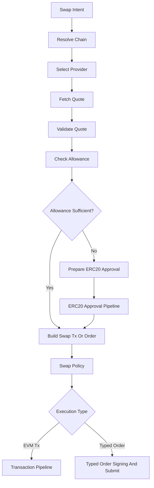

# Mercury Phase 8: Swap Integrations

## Goal

Add swap capabilities to Mercury through normalized provider adapters. Start with LiFi because it is multichain and route-oriented, then add CowSwap and Uniswap behind the same quote/build abstraction.

All swap transactions must reuse the existing ERC20 allowance logic, transaction pipeline, policy checks, approval interrupt, 1Claw signer boundary, broadcast, and monitoring.

## Scope

- Add normalized swap intent, quote, route, and build models.
- Add LiFi quote and transaction-build adapter first.
- Add CowSwap quote and order adapter.
- Add Uniswap quote/build adapter.
- Resolve provider API keys through 1Claw where needed.
- Add allowance checks and approval preparation for swap spenders.
- Add swap-specific policy rules.
- Add graph routes for swap intents.
- Add tests using mocked provider APIs.

## Out Of Scope

- No protocol deposits beyond swap/bridge provider routes.
- No automatic execution without approval.
- No MEV/private relay support unless provider response already includes it.
- No advanced portfolio optimization.
- No pan-agentikit adapter yet.
- No MCP server exposure yet.

## Proposed Files

- [`mercury/models/swaps.py`](mercury/models/swaps.py): swap intent, quote, route, provider, and build models.
- [`mercury/swaps/base.py`](mercury/swaps/base.py): provider protocol and normalized interfaces.
- [`mercury/swaps/lifi.py`](mercury/swaps/lifi.py): LiFi adapter.
- [`mercury/swaps/cowswap.py`](mercury/swaps/cowswap.py): CowSwap adapter.
- [`mercury/swaps/uniswap.py`](mercury/swaps/uniswap.py): Uniswap adapter.
- [`mercury/swaps/router.py`](mercury/swaps/router.py): provider selection and quote routing.
- [`mercury/tools/swaps.py`](mercury/tools/swaps.py): LangChain-compatible swap tools.
- [`mercury/policy/swap_rules.py`](mercury/policy/swap_rules.py): swap-specific policy checks.
- [`mercury/graph/nodes_swaps.py`](mercury/graph/nodes_swaps.py): swap graph nodes.
- [`mercury/graph/router.py`](mercury/graph/router.py): swap route additions.
- [`tests/test_swap_models.py`](tests/test_swap_models.py): normalized model tests.
- [`tests/test_lifi_adapter.py`](tests/test_lifi_adapter.py): mocked LiFi tests.
- [`tests/test_cowswap_adapter.py`](tests/test_cowswap_adapter.py): mocked CowSwap tests.
- [`tests/test_uniswap_adapter.py`](tests/test_uniswap_adapter.py): mocked Uniswap tests.
- [`tests/test_swap_policy.py`](tests/test_swap_policy.py): swap policy tests.
- [`tests/test_graph_swap_routes.py`](tests/test_graph_swap_routes.py): graph route tests.

## Provider Order

1. LiFi:
   - best first choice for multichain swaps/bridges
   - should support Ethereum and Base initially
   - returns transaction data that can feed the phase 6 pipeline
2. CowSwap:
   - order-based flow
   - requires EIP-712 signing support from phase 5 if submitting orders
   - may not map to normal transaction broadcast
3. Uniswap:
   - direct quote/build flow where API support is available
   - keep SDK-specific complexity isolated
   - if a TypeScript SDK sidecar is needed later, keep it behind the same Python adapter interface

## Normalized Swap Flow

## Swap Intent Model

Support fields:

- `wallet_id`
- `chain`
- `from_token`
- `to_token`
- `amount_in`
- optional `min_amount_out`
- optional `max_slippage_bps`
- optional `provider_preference`
- optional `recipient_address`
- `idempotency_key`

## Normalized Provider Interface

Each provider adapter should implement:

- `get_quote(request: SwapQuoteRequest) -> SwapQuote`
- `build_execution(quote: SwapQuote) -> SwapExecution`

`SwapExecution` can be one of:

- EVM transaction payload
- ERC20 approval requirement
- EIP-712 order payload
- unsupported route with reason

## 1Claw Provider Secret Paths

- `mercury/apis/lifi`
- `mercury/apis/cowswap`
- `mercury/apis/uniswap`

If a provider does not require an API key for MVP, keep the path optional but still model it as 1Claw-managed when configured.

## Implementation Steps

1. Add normalized swap models.
2. Add swap provider protocol.
3. Add provider API key resolution using phase 2 1Claw secret store.
4. Implement LiFi adapter:
   - quote request
   - route normalization
   - transaction build normalization
   - spender extraction for allowance checks
5. Add LiFi graph path from swap intent to quote to build to transaction pipeline.
6. Add swap policy rules:
   - max slippage
   - supported chain
   - supported token address format
   - recipient validation
   - provider allowlist
   - quote expiry
   - minimum output checks
7. Add allowance check using phase 7 ERC20 reads/builders.
8. Add approval-before-swap path when allowance is insufficient.
9. Add CowSwap adapter:
   - quote normalization
   - order payload normalization
   - EIP-712 typed-data signing path if phase 5 supports it
   - submit order through provider API
10. Add Uniswap adapter:
   - quote normalization
   - transaction build normalization
   - isolate SDK/API assumptions
11. Add graph route tests with mocked providers.
12. Add README examples for swap requests and safety behavior.

## Policy Rules For This Phase

- Require approval for every swap execution in MVP.
- Reject slippage above configured maximum.
- Reject provider not in allowlist.
- Reject quote if expired.
- Reject route if chain ID mismatches requested chain.
- Reject route if spender is missing or not validated.
- Require explicit user approval for bridge routes when source and destination chains differ.
- Require recipient address validation when recipient differs from wallet address.

## Security Requirements

- Provider API keys are resolved only through 1Claw.
- Provider responses are treated as untrusted until validated.
- Transaction `to`, `data`, `value`, `chainId`, spender, and token addresses must be policy-checked before signing.
- Swap execution must pass through the same approval and signer boundary as ERC20 transactions.
- CowSwap typed-data signing must use the signer boundary and must show order details before approval.
- No provider adapter can call the signer directly except through the approved pipeline.

## Testing Plan

- Swap model tests:
  - valid quote normalization
  - invalid slippage rejected
  - invalid token address rejected
- LiFi tests:
  - quote response normalizes correctly
  - transaction build response produces prepared transaction
  - spender extracted for allowance checks
- Allowance tests:
  - sufficient allowance skips approval builder
  - insufficient allowance creates approval step before swap
- Policy tests:
  - excessive slippage rejected
  - expired quote rejected
  - unknown provider rejected
  - chain mismatch rejected
- CowSwap tests:
  - quote normalizes correctly
  - typed order payload is created or explicitly deferred
- Uniswap tests:
  - quote/build normalizes correctly with mocked API
- Graph tests:
  - swap intent routes through quote, allowance, build, policy, and execution pipeline

## Acceptance Criteria

- LiFi swap quotes and transaction builds work through mocked provider tests.
- Swap executions reuse the phase 6 transaction pipeline.
- ERC20 approvals are prepared before swaps when allowance is insufficient.
- Swap provider API keys are modeled as 1Claw-managed secrets.
- Swap policy rejects unsafe provider responses.
- CowSwap and Uniswap adapters exist behind the normalized interface, even if advanced functionality is partially deferred with explicit unsupported results.
- No swap path bypasses policy, approval, or signer boundary.

## Hand-Off To Phase 9

Phase 9 should expose Mercury through a FastAPI boundary:

- HTTP request/response models
- health checks
- graph invocation endpoint
- dependency wiring for config, 1Claw, Web3, providers, and graph runtime
- no pan-agentikit envelope handling yet unless kept as a placeholder