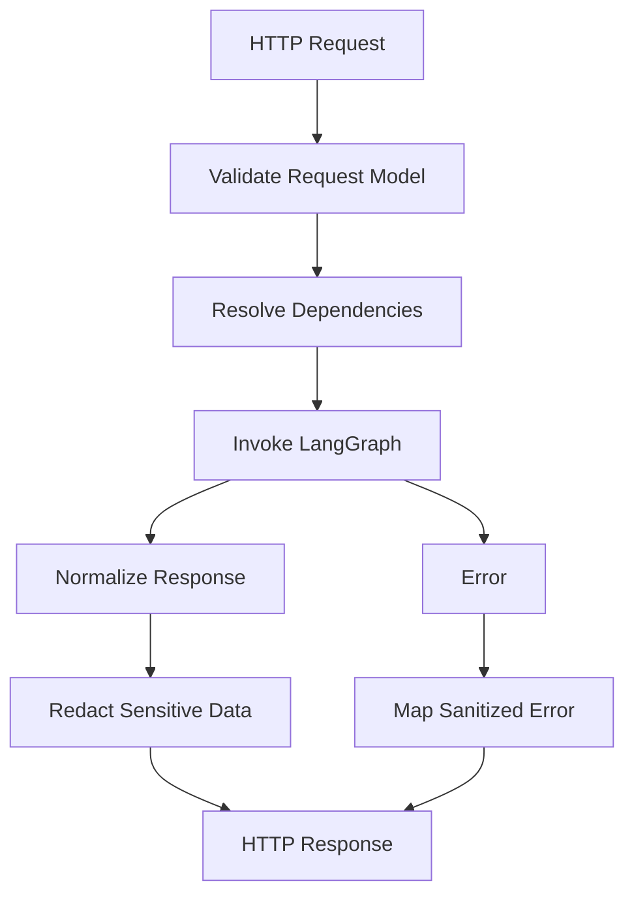

# Mercury Phase 9: FastAPI Service Boundary

## Goal

Expose Mercury as an HTTP service using FastAPI. This phase creates the operational service boundary around the LangGraph agent, wires dependencies, and provides safe request/response models for read-only and value-moving requests.

pan-agentikit envelope compatibility comes in phase 10.

## Scope

- Add FastAPI application entrypoint.
- Add health and readiness endpoints.
- Add graph invocation endpoint.
- Add request/response models for Mercury-native API calls.
- Add dependency wiring for settings, 1Claw secret store, Web3 provider factory, swap providers, signer, and graph runtime.
- Add request IDs and idempotency-key handling at the HTTP boundary.
- Add sanitized exception handlers.
- Add structured logging with secret redaction.
- Add tests using FastAPI test client.

## Out Of Scope

- No pan-agentikit envelope handling yet.
- No public MCP server exposure.
- No authentication/authorization beyond placeholder hooks unless already available.
- No production deployment config beyond minimal local run docs.
- No background worker architecture beyond receipt monitoring already available from phase 6.

## Proposed Files

- [`mercury/service/api.py`](mercury/service/api.py): FastAPI app factory and routes.
- [`mercury/service/dependencies.py`](mercury/service/dependencies.py): dependency wiring.
- [`mercury/service/models.py`](mercury/service/models.py): HTTP request/response models.
- [`mercury/service/errors.py`](mercury/service/errors.py): HTTP exception mapping.
- [`mercury/service/logging.py`](mercury/service/logging.py): structured logging and redaction config.
- [`mercury/service/__init__.py`](mercury/service/__init__.py): service exports.
- [`mercury/graph/runtime.py`](mercury/graph/runtime.py): graph runtime/dependency factory if needed.
- [`tests/test_service_health.py`](tests/test_service_health.py): health/readiness endpoint tests.
- [`tests/test_service_invoke.py`](tests/test_service_invoke.py): graph invocation API tests.
- [`tests/test_service_errors.py`](tests/test_service_errors.py): sanitized error handling tests.

## Service API Shape

Initial endpoints:

- `GET /healthz`
- `GET /readyz`
- `POST /v1/mercury/invoke`

Optional debugging endpoint only if safe and disabled by default:

- `GET /v1/mercury/chains`

## Request Model

`POST /v1/mercury/invoke` should accept:

- `request_id`
- `user_id`
- `wallet_id`
- `intent`
- optional `chain`
- optional `idempotency_key`
- optional `approval_response`
- optional metadata

The request should be converted into the LangGraph state/input format internally.

## Response Model

Return:

- `request_id`
- `status`
- `chain`
- `message`
- optional `data`
- optional `tx_hash`
- optional `receipt`
- optional `approval_required`
- optional `approval_payload`
- optional sanitized `error`

Never return private keys, RPC URLs, provider API keys, or raw 1Claw secret values.

## Service Flow

## Implementation Steps

1. Add FastAPI and Uvicorn dependencies.
2. Add `create_app(settings=None)` factory.
3. Add health endpoint:
   - returns process up status
   - does not touch external services
4. Add readiness endpoint:
   - validates config can load
   - optionally validates chain registry exists
   - does not fetch private keys
5. Add Mercury invoke request/response Pydantic models.
6. Add dependency wiring:
   - settings
   - 1Claw secret store
   - Web3 provider factory
   - signer
   - swap provider router
   - graph runtime
7. Add graph invocation route:
   - validate request
   - create graph input state
   - invoke graph
   - normalize result
8. Add idempotency key propagation from HTTP request to graph state.
9. Add request ID propagation for logs and responses.
10. Add sanitized exception handlers:
   - validation errors
   - custody errors
   - chain errors
   - policy rejections
   - graph execution errors
11. Add structured logging with redaction hooks from phase 5.
12. Add local run docs in README.
13. Add tests using fake dependencies and FastAPI test client.

## Security Requirements

- HTTP responses must never include secrets.
- Logs must redact wallet private keys, RPC URLs, provider API keys, signed raw transaction hex if considered sensitive, and 1Claw credentials.
- Readiness checks must not fetch wallet private keys.
- Value-moving requests must still pass through policy and approval nodes.
- Approval-required responses must show human-readable transaction details without secrets.
- Request validation must reject malformed wallet IDs and addresses before graph execution when possible.

## Testing Plan

- Health tests:
  - `/healthz` returns OK
  - `/readyz` returns OK with fake dependencies
- Invoke tests:
  - read-only request invokes fake graph and returns normalized response
  - approval-required graph result maps to HTTP response
  - transaction success graph result maps to tx response
- Error tests:
  - validation error maps to 422
  - custody error maps to sanitized response
  - graph error maps to sanitized 500 or domain status
  - secret-like strings are redacted in response
- Dependency tests:
  - app can be created with fake graph/runtime
  - no private-key fetch occurs during startup

## Acceptance Criteria

- FastAPI app imports and starts locally.
- `/healthz` and `/readyz` work.
- `/v1/mercury/invoke` can invoke the graph with fake dependencies in tests.
- Request ID and idempotency key pass into graph state.
- Errors are sanitized.
- No pan-agentikit envelope handling is introduced yet.
- Tests pass without live network access.

## Hand-Off To Phase 10

Phase 10 should add pan-agentikit compatibility:

- map pan-agentikit `Envelope` payloads into Mercury request models
- map Mercury responses back into `Envelope` payloads
- preserve trace IDs, turn IDs, roles, artifacts, errors, and idempotency metadata
- keep the native `/v1/mercury/invoke` endpoint available for direct use