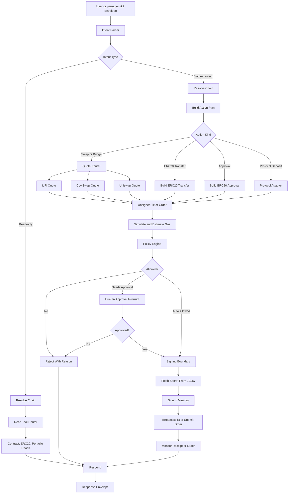

# Mercury Wallet Agent Plan

## Architecture Decisions

- Use **LangGraph** as the runtime because Mercury needs explicit state transitions for planning, simulation, policy checks, approvals, signing, broadcasting, and monitoring.
- Use **LangChain tools** inside the graph for typed blockchain capabilities.
- Use **1Claw for all key and secret management**: wallet private keys, RPC URLs/API keys, LiFi/CowSwap/Uniswap credentials, and future agent tokens.
- Do not expose raw 1Claw secret retrieval to the LLM. Only backend custody tools can fetch secrets internally.
- Use Python as the main implementation language to align with `pan-agentikit` and LangGraph.
- Keep Uniswap SDK/API behind an adapter. If a TypeScript SDK path becomes necessary later, isolate it as a sidecar rather than mixing runtimes in the core agent.

## Target Structure

- [`pyproject.toml`](pyproject.toml): Python project metadata and dependencies.
- [`langgraph.json`](langgraph.json): LangGraph app config.
- [`mercury/graph/state.py`](mercury/graph/state.py): typed graph state.
- [`mercury/graph/agent.py`](mercury/graph/agent.py): graph construction.
- [`mercury/graph/nodes.py`](mercury/graph/nodes.py): intent parsing, routing, policy, approval, signing, monitoring nodes.
- [`mercury/chains/registry.py`](mercury/chains/registry.py): Ethereum and Base chain registry, extensible by config.
- [`mercury/custody/oneclaw.py`](mercury/custody/oneclaw.py): 1Claw secret client wrapper.
- [`mercury/custody/signer.py`](mercury/custody/signer.py): isolated signing boundary that fetches secrets from 1Claw internally.
- [`mercury/tools/evm.py`](mercury/tools/evm.py): contract reads, gas estimates, transaction simulation.
- [`mercury/tools/erc20.py`](mercury/tools/erc20.py): balances, allowances, approvals, transfers.
- [`mercury/tools/lifi.py`](mercury/tools/lifi.py): LiFi quote and transaction build adapter.
- [`mercury/tools/cowswap.py`](mercury/tools/cowswap.py): CowSwap quote and order adapter.
- [`mercury/tools/uniswap.py`](mercury/tools/uniswap.py): Uniswap quote and transaction build adapter.
- [`mercury/policy/risk.py`](mercury/policy/risk.py): transaction policy engine.
- [`mercury/service/api.py`](mercury/service/api.py): FastAPI entrypoint.
- [`mercury/service/pan_agentikit_handler.py`](mercury/service/pan_agentikit_handler.py): future pan-agentikit envelope adapter.
- [`tests/`](tests/): focused unit tests for chain registry, tools, custody boundaries, and policy decisions.

## LangGraph Flow

## 1Claw Secret Model

Use path conventions like:

- `mercury/wallets/{wallet_id}/private_key`
- `mercury/rpc/ethereum`
- `mercury/rpc/base`
- `mercury/apis/lifi`
- `mercury/apis/cowswap`
- `mercury/apis/uniswap`
- `mercury/agents/{agent_id}/token`

The graph and LLM-facing tools should only receive wallet IDs, chain names, token addresses, and transaction intents. The private key is fetched only inside [`mercury/custody/signer.py`](mercury/custody/signer.py), used in memory, and discarded immediately.

## Initial Tool Surface

- `get_wallet_address`
- `get_native_balance`
- `get_erc20_balance`
- `get_erc20_allowance`
- `read_contract`
- `estimate_gas`
- `simulate_transaction`
- `prepare_erc20_transfer`
- `prepare_erc20_approval`
- `get_lifi_quote`
- `build_lifi_swap_tx`
- `get_cowswap_quote`
- `create_cowswap_order`
- `get_uniswap_quote`
- `build_uniswap_swap_tx`
- `sign_and_send_transaction`
- `monitor_transaction`

## Policy Rules For MVP

- Default chain is Ethereum; Base is supported from day one.
- Require explicit chain resolution for every operation.
- Require human approval for every value-moving action in the MVP.
- Reject unsupported chain IDs.
- Reject unknown spender addresses unless explicitly approved.
- Reject unlimited ERC20 approvals by default.
- Validate recipient, token, amount, slippage, gas estimate, and chain ID before signing.
- Store idempotency metadata before broadcasting to avoid duplicate sends.
- Return transaction hash, receipt, and status only; never return private key material or raw secrets.

## Implementation Phases

1. Scaffold the project and dependency baseline.
2. Implement chain registry and 1Claw custody wrapper.
3. Implement read-only EVM and ERC20 tools.
4. Build the first LangGraph read-only path.
5. Implement signer boundary using 1Claw-managed wallet keys.
6. Add transaction build, simulation, policy checks, approval interrupt, broadcast, and monitor nodes.
7. Add ERC20 transfer and approval flows.
8. Add LiFi swap support first, then CowSwap, then Uniswap.
9. Add FastAPI service boundary.
10. Add pan-agentikit envelope adapter for future multi-agent delegation.
11. Add tests for registry, tools, policy, signer isolation, and graph routing.

## MVP Acceptance Criteria

- Mercury can answer wallet balance and ERC20 balance questions on Ethereum and Base.
- Mercury can read a contract method on Ethereum or Base.
- Mercury can prepare, simulate, approve, sign, broadcast, and monitor an ERC20 transfer using a private key fetched from 1Claw.
- Mercury can prepare a LiFi swap transaction and pass it through the same policy and signing pipeline.
- No LLM-facing tool exposes raw 1Claw secrets.
- The graph has a mandatory approval point before signing.
- The service shape is compatible with future pan-agentikit `Envelope -> Envelope` integration.