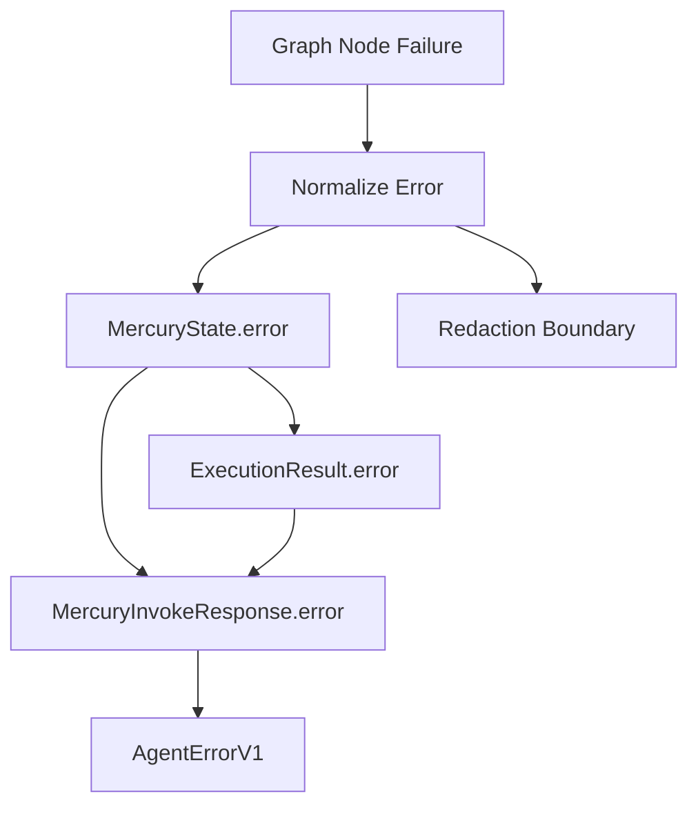

# Structured Mercury Errors

## Goal
Mercury should return errors that are clear, sanitized, and machine-actionable. The LLM should inspect fields like `code`, `category`, `retryable`, and `llm_action` instead of reasoning from generic strings such as `Mercury request failed.` or `Internal server error.`

This refresh is based on the current `main` branch at `094563e`. The fetched updates do not add a structured error model yet. Since backwards compatibility is not required, replace the string-only error contract directly instead of layering a transitional `error_info` field beside it.

## Current Shape
The current implementation sanitizes errors, but loses structure early:

- [`mercury/graph/state.py`](mercury/graph/state.py) stores `error: str`.
- [`mercury/graph/nodes.py`](mercury/graph/nodes.py), [`mercury/graph/nodes_transaction.py`](mercury/graph/nodes_transaction.py), [`mercury/graph/nodes_erc20.py`](mercury/graph/nodes_erc20.py), [`mercury/graph/nodes_native.py`](mercury/graph/nodes_native.py), and [`mercury/graph/nodes_swaps.py`](mercury/graph/nodes_swaps.py) return plain `{"error": sanitize_error(exc)}`.
- [`mercury/models/execution.py`](mercury/models/execution.py) has `ExecutionResult.error: str | None`.
- [`mercury/service/models.py`](mercury/service/models.py) exposes only `MercuryError.message` and optional `code`.
- [`mercury/service/errors.py`](mercury/service/errors.py) maps unknown exceptions to `Internal server error.`.

## Proposed Design
Add one domain-level error payload, then use it consistently through graph state, execution results, native HTTP responses, and pan-agentikit envelopes.

Proposed model in a new [`mercury/models/errors.py`](mercury/models/errors.py):

```python
class MercuryErrorInfo(BaseModel):
    code: str
    category: str
    message: str
    retryable: bool = False
    recoverable: bool = True
    user_action: str | None = None
    llm_action: str | None = None
    details: dict[str, Any] = Field(default_factory=dict)
```

Replace string-only error fields with this structured model:

- `MercuryState.error: MercuryErrorInfo`
- `ExecutionResult.error: MercuryErrorInfo | None`
- `MercuryInvokeResponse.error: MercuryError`

Routing checks like `if state.get("error")` can stay, but code that formats, serializes, or logs errors should use `error.message` and `error.model_dump(mode="json")`.

Use helper constructors instead of ad hoc strings:

- `unsupported_intent(...)`
- `validation_failed(...)`
- `missing_chain_config(...)`
- `rpc_unavailable(...)`
- `policy_rejected(...)`
- `approval_required(...)`
- `simulation_failed(...)`
- `signing_failed(...)`
- `broadcast_failed(...)`
- `internal_error(...)`

Keep all public text sanitized with existing [`mercury/service/logging.py`](mercury/service/logging.py) redaction logic.

## Data Flow



## Implementation Steps

1. Add structured error models and helpers in [`mercury/models/errors.py`](mercury/models/errors.py).
2. Update [`mercury/graph/state.py`](mercury/graph/state.py) so `error` is `MercuryErrorInfo` instead of `str`.
3. Update graph nodes to return structured failures, for example `{"error": normalize_exception(exc, stage="resolve_chain")}`. Cover [`mercury/graph/nodes.py`](mercury/graph/nodes.py), [`mercury/graph/nodes_transaction.py`](mercury/graph/nodes_transaction.py), [`mercury/graph/nodes_erc20.py`](mercury/graph/nodes_erc20.py), [`mercury/graph/nodes_native.py`](mercury/graph/nodes_native.py), and [`mercury/graph/nodes_swaps.py`](mercury/graph/nodes_swaps.py).
4. Update response formatting in [`mercury/graph/responses.py`](mercury/graph/responses.py) so read-only errors use `error.message`, while unsupported responses can include `error.llm_action` when useful.
5. Update [`mercury/models/execution.py`](mercury/models/execution.py) so `ExecutionResult.error` is `MercuryErrorInfo | None`.
6. Update transaction result builders in [`mercury/graph/nodes_transaction.py`](mercury/graph/nodes_transaction.py) so rejected, failed, approval-denied, simulation, signing, broadcast, and idempotency failures retain structured errors.
7. Update [`mercury/service/models.py`](mercury/service/models.py) so `MercuryError` includes `code`, `category`, `message`, `retryable`, `recoverable`, `user_action`, `llm_action`, and `details`.
8. Update [`mercury/service/api.py`](mercury/service/api.py) to serialize structured errors directly and use `error.message` for the top-level `message`.
9. Update [`mercury/service/pan_agentikit_models.py`](mercury/service/pan_agentikit_models.py) and [`mercury/service/pan_agentikit_handler.py`](mercury/service/pan_agentikit_handler.py) so `AgentErrorV1` carries the same structured fields without wrapping them in legacy string-only details.
10. Improve [`mercury/service/errors.py`](mercury/service/errors.py) exception handlers so FastAPI-level errors return stable `code`, `category`, `request_id`, and generic `llm_action` without exposing internals.
11. Extend tests in [`tests/test_service_errors.py`](tests/test_service_errors.py), [`tests/test_service_invoke.py`](tests/test_service_invoke.py), [`tests/test_service_pan_agentikit_route.py`](tests/test_service_pan_agentikit_route.py), [`tests/service/test_native_api.py`](tests/service/test_native_api.py), and [`tests/security/test_secret_leakage.py`](tests/security/test_secret_leakage.py).

## Contract Rules

- Keep top-level `response.message` as the concise human-readable summary.
- Make `error.message` the sanitized human-readable error summary.
- Replace string-only internal error values with `MercuryErrorInfo`.
- Do not add transitional duplicate fields such as `error_info`.
- Do not expose raw exception strings when they contain RPC URLs, secret paths, tokens, private keys, raw transactions, or long signed payloads.
- Keep HTTP status behavior stable unless the existing status is clearly wrong.

## Example Target Response

```json
{
  "request_id": "req-123",
  "status": "failed",
  "message": "Base RPC is unavailable.",
  "error": {
    "code": "rpc_unavailable",
    "category": "rpc",
    "message": "Base RPC is unavailable.",
    "retryable": true,
    "recoverable": true,
    "user_action": "Try again later or choose another supported chain.",
    "llm_action": "Retry once with backoff. If it fails again, ask the user whether to use another supported chain.",
    "details": {
      "chain": "base",
      "stage": "resolve_nonce"
    }
  }
}
```

## Test Plan

- Assert validation errors include `code`, field details, and clear `llm_action`.
- Assert graph/tool failures include stage-specific codes rather than `mercury_error` where possible.
- Assert native and pan-agentikit routes expose the same structured error fields.
- Assert existing success and approval-required responses still pass.
- Assert secret leakage tests still reject RPC URLs, secret paths, bearer tokens, private keys, and raw transactions.