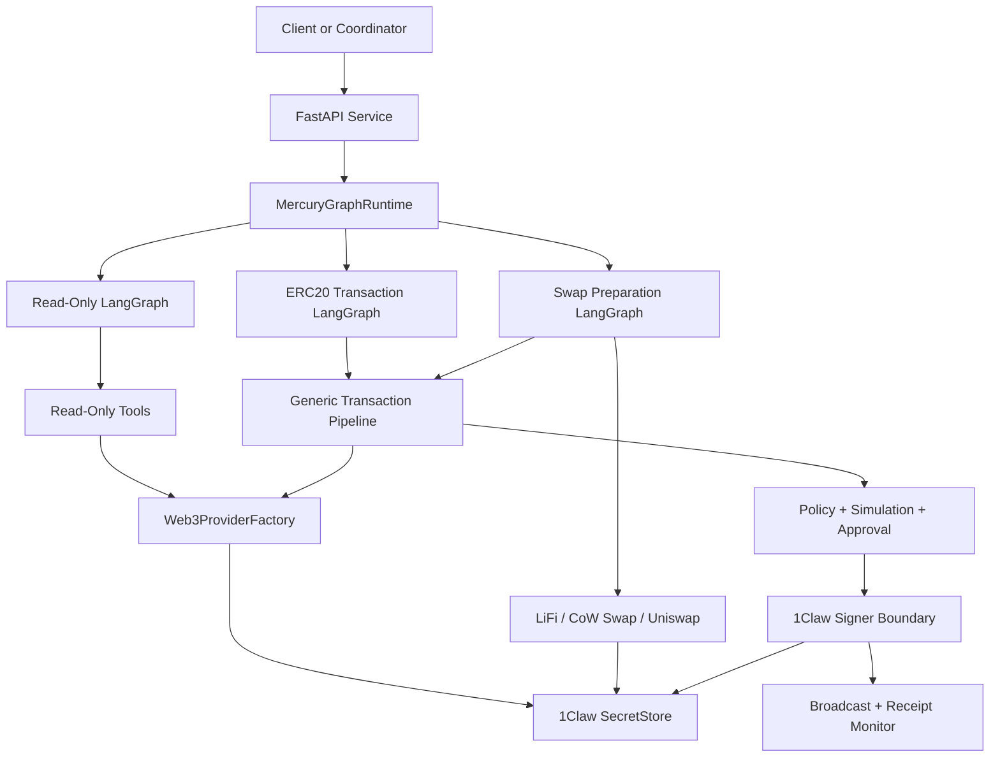

# Mercury

Mercury is a security-first EVM wallet agent for the Agentic Pantheon project. It
provides a typed LangGraph runtime, FastAPI service boundaries, and wallet tooling for
read-only chain inspection, ERC20 actions, generic transactions, and swap preparation.
All secrets are resolved through 1Claw, and private keys are confined to a narrow
signer boundary.

Mercury currently supports Ethereum and Base and is designed so new chains, providers,
service adapters, and policy rules can be added without changing the core custody
model.

## What Mercury Can Do

- Read native balances, ERC20 balances, ERC20 allowances, ERC20 metadata, and
  view/pure contract calls.
- Prepare and execute generic EVM transactions through a guarded pipeline.
- Prepare ERC20 transfers and approvals, including amount parsing and allowance
  safety checks.
- Prepare normalized swap transactions using LiFi, CoW Swap, and Uniswap adapters.
- Require policy checks, idempotency, and human approval before value-moving signing.
- Sign transactions and EIP-712 typed data through a 1Claw-backed private-key boundary.
- Expose both a native HTTP API and a pan-agentikit-compatible envelope API.

Mercury is intentionally conservative. Runtime readiness does not fetch wallet private
keys, tests do not require real secrets, and value-moving actions do not sign unless
they pass simulation, policy, approval, and idempotency gates.

## High-Level Architecture



Mercury separates the system into strict boundaries:

- Service boundary: HTTP request parsing, response shaping, logging, and redaction.
- Graph boundary: LangGraph routing between read-only, ERC20, swap, and transaction
  workflows.
- Tool/provider boundary: Web3 calls, ERC20 ABI calls, provider quote normalization,
  and broadcast operations.
- Policy boundary: chain validation, simulation checks, approval requirements,
  swap safety, ERC20 approval safety, and idempotency.
- Custody boundary: 1Claw-backed secret lookup and private-key signing.

## Component Guide

### Configuration and Chains

`mercury/config.py` defines typed settings using `pydantic-settings`. Settings store
secret references and 1Claw metadata, not secret values.

`mercury/chains/registry.py` defines the supported chain registry:

- `ethereum`, chain ID `1`
- `base`, chain ID `8453`

Each chain has a 1Claw RPC secret path. `mercury/chains/rpc.py` resolves an RPC URL
through the `SecretStore` protocol when a provider actually needs it.

### Custody and 1Claw

`mercury/custody/oneclaw.py` contains the secret-store abstraction:

- `SecretStore`: protocol used by runtime code.
- `OneClawSecretStore`: 1Claw-backed implementation.
- `OneClawHttpClient`: small HTTP client adapter.
- `FakeSecretStore`: test/local fake used by unit tests.
- `SecretValue`: wrapper that only exposes the raw secret through explicit
  `reveal()`.

`mercury/custody/signer.py` contains `MercuryWalletSigner`, the only component that
loads wallet private keys. It can:

- derive a wallet address from `wallet_id`;
- sign a fully prepared EVM transaction;
- sign EIP-712 typed data.

It does not broadcast transactions, log private keys, expose private keys, or place
private keys into graph state.

### Providers and Tools

`mercury/providers/web3.py` builds Web3 clients from chain RPC URLs resolved through
1Claw.

`mercury/tools/evm.py` and `mercury/tools/erc20.py` expose read-only tool functions
and LangChain-compatible wrappers:

- `get_native_balance`
- `get_erc20_metadata`
- `get_erc20_balance`
- `get_erc20_allowance`
- `read_contract`

`mercury/tools/erc20_transactions.py` prepares unsigned ERC20 transactions:

- transfer calldata for `transfer(address,uint256)`;
- approval calldata for `approve(address,uint256)`;
- balance, allowance, zero-address, self-transfer, decimal, and unlimited-approval
  checks.

`mercury/tools/swaps.py` prepares the next safe swap-related transaction. If allowance
is insufficient it prepares an ERC20 approval first. If allowance is sufficient it
prepares the provider-built swap transaction for the generic transaction pipeline.

### LangGraph Runtime

`mercury/graph/agent.py` builds the project graphs:

- `build_graph`: read-only graph.
- `build_transaction_graph`: generic transaction pipeline.
- `build_erc20_transaction_graph`: ERC20 builder plus transaction pipeline.
- `build_swap_transaction_graph`: swap preparation plus transaction pipeline.

`mercury/graph/runtime.py` provides `MercuryGraphRuntime`, which chooses the right
graph based on the structured request `kind`.

Read-only kinds:

- `native_balance`
- `erc20_metadata`
- `erc20_balance`
- `erc20_allowance`
- `contract_read`

Value-moving kinds:

- `erc20_transfer`
- `erc20_approval`
- `swap`

### Transaction Pipeline

`mercury/graph/nodes_transaction.py` and `mercury/tools/transactions.py` implement a
generic EVM transaction workflow:

1. Resolve wallet public address and nonce.
2. Populate gas and fees.
3. Simulate/preflight the transaction.
4. Evaluate policy.
5. Request human approval when required.
6. Reserve idempotency key.
7. Sign through `MercuryWalletSigner`.
8. Broadcast the signed raw transaction.
9. Wait for a receipt.

The pipeline is dependency-injected and fakeable. Tests assert that signing cannot
happen before policy, approval, and idempotency gates.

### Policy

`mercury/policy/risk.py`, `mercury/policy/rules.py`, and
`mercury/policy/swap_rules.py` implement conservative MVP policy checks:

- reject unsupported chains and chain ID mismatches;
- reject failed simulations;
- require idempotency for value-moving transactions;
- require approval for native value transfers, ERC20 transfers, ERC20 approvals, and
  swaps;
- reject unlimited ERC20 approvals by default;
- reject expired swap quotes, excessive slippage, missing swap spenders, and bridge
  routes by default.

### Swap Providers

`mercury/swaps/` contains normalized provider adapters:

- `LiFiProvider`: quote and EVM transaction build path.
- `CowSwapProvider`: quote and typed-order normalization; order submission is
  intentionally not automatic.
- `UniswapProvider`: quote and EVM transaction build path.
- `SwapRouter`: provider selection and quote routing.

Provider responses are treated as untrusted and validated into Mercury models before
they can be used by policy or the transaction pipeline.

### HTTP Service

`mercury/service/api.py` exposes:

- `GET /healthz`
- `GET /readyz`
- `POST /v1/mercury/invoke`
- `POST /v1/agent`

`/v1/mercury/invoke` is Mercury's native API. `/v1/agent` is a local
pan-agentikit-compatible `Envelope -> Envelope` adapter. The adapter accepts
`user_message` and `task_request` payloads and returns `agent_reply`, `task_result`,
`wallet_approval_required`, or `agent_error` payloads.

All service responses and structured logs pass through redaction helpers before
leaving the process.

## Repository Layout

```text
mercury/
  abi/                 ERC20 ABI fragments
  chains/              chain registry and RPC resolution
  custody/             1Claw secret store, signer, redaction, wallet paths
  graph/               LangGraph state, nodes, routes, runtime builders
  models/              pydantic domain models
  policy/              policy and idempotency rules
  providers/           Web3 provider factory
  service/             FastAPI app, dependencies, API models, adapters
  swaps/               normalized swap provider adapters
  tools/               EVM, ERC20, swap, transaction tool boundaries
tests/
  fakes/               shared fake secret stores, signers, Web3, providers
  graph/               graph-level route coverage
  integration/         optional live read-only tests
  security/            secret leakage and policy regression tests
  service/             service-level route coverage
```

## Local Development

Mercury uses Python 3.12 and `uv`.

```bash
uv sync
```

Run the full local validation suite:

```bash
uv run pytest
uv run ruff check .
uv run ruff format --check .
uv run mypy mercury tests
```

Format the project:

```bash
uv run ruff format .
```

Run the FastAPI service locally:

```bash
uv run uvicorn mercury.service.api:app --reload
```

Then check health and readiness:

```bash
curl http://127.0.0.1:8000/healthz
curl http://127.0.0.1:8000/readyz
```

`/readyz` validates local settings and the static chain registry only. It does not
fetch wallet private keys.

## Local Configuration

Copy `.env.example` only when you need local overrides:

```bash
cp .env.example .env
```

Current environment variables:

```bash
MERCURY_APP_NAME=Mercury Wallet Agent
MERCURY_DEFAULT_CHAIN=ethereum
MERCURY_ETHEREUM_RPC_SECRET_PATH=mercury/rpc/ethereum
MERCURY_BASE_RPC_SECRET_PATH=mercury/rpc/base
MERCURY_ONECLAW_BASE_URL=http://localhost:8080
MERCURY_ONECLAW_VAULT_ID=mercury
MERCURY_ONECLAW_API_KEY_SECRET_SOURCE=MERCURY_ONECLAW_API_KEY
MERCURY_ONECLAW_AGENT_ID=
```

The values ending in `_SECRET_PATH` are 1Claw paths, not secret values. Do not put RPC
URLs, private keys, or provider API keys in `.env`.

The service dependency builder reads the 1Claw API key from the environment variable
named by `MERCURY_ONECLAW_API_KEY_SECRET_SOURCE`. With the default configuration that
means:

```bash
export MERCURY_ONECLAW_API_KEY="..."
```

## How To Use 1Claw

Mercury expects 1Claw to store all live secrets. The LLM and graph state should only
see IDs, addresses, and sanitized metadata.

### Required Secret Paths

Store these RPC URLs:

```text
mercury/rpc/ethereum
mercury/rpc/base
```

Store provider API keys if you use provider features that require them:

```text
mercury/apis/lifi
mercury/apis/cowswap
mercury/apis/uniswap
```

Store wallet private keys by wallet ID:

```text
mercury/wallets/{wallet_id}/private_key
```

For example, wallet ID `primary` maps to:

```text
mercury/wallets/primary/private_key
```

Wallet IDs are validated before path construction. They may contain alphanumeric
characters plus `_`, `.`, and `-`, and path traversal values are rejected.

### Runtime Flow With 1Claw

1. Service dependencies create `OneClawHttpClient` and `OneClawSecretStore`.
2. `Web3ProviderFactory` resolves `mercury/rpc/{chain}` only when a Web3 operation is
   needed.
3. Swap providers resolve API keys through `mercury/apis/{provider}` only when a
   provider request needs one.
4. `MercuryWalletSigner` resolves `mercury/wallets/{wallet_id}/private_key` only
   inside custody code, immediately before deriving an address or signing.
5. Signed payloads return only public signer address, transaction hash, raw signed
   transaction, or signature. Private keys never leave the signer boundary.

### 1Claw Example Setup

The exact 1Claw CLI/API may differ by deployment, but the Mercury-side contract is:

```text
vault: mercury
agent_id: optional Mercury agent scope
secret paths:
  mercury/rpc/ethereum -> https://...
  mercury/rpc/base -> https://...
  mercury/apis/lifi -> ...
  mercury/apis/cowswap -> ...
  mercury/apis/uniswap -> ...
  mercury/wallets/primary/private_key -> 0x...
```

For local service construction:

```bash
export MERCURY_ONECLAW_BASE_URL="https://your-1claw-host"
export MERCURY_ONECLAW_VAULT_ID="mercury"
export MERCURY_ONECLAW_API_KEY_SECRET_SOURCE="MERCURY_ONECLAW_API_KEY"
export MERCURY_ONECLAW_API_KEY="your-1claw-api-key"
export MERCURY_ONECLAW_AGENT_ID="mercury-local" # optional
```

Never commit `.env` files or real secrets. `.env.example` intentionally contains only
secret paths and non-secret configuration.

## Native API Examples

Start the service:

```bash
uv run uvicorn mercury.service.api:app --reload
```

Read a native balance:

```bash
curl -X POST http://127.0.0.1:8000/v1/mercury/invoke \
  -H "Content-Type: application/json" \
  -H "X-Request-ID: req-balance-1" \
  -d '{
    "user_id": "user-1",
    "wallet_id": "primary",
    "chain": "base",
    "intent": {
      "kind": "native_balance",
      "wallet_address": "0x000000000000000000000000000000000000dEaD"
    }
  }'
```

Prepare an ERC20 transfer request:

```bash
curl -X POST http://127.0.0.1:8000/v1/mercury/invoke \
  -H "Content-Type: application/json" \
  -H "Idempotency-Key: erc20-transfer-1" \
  -d '{
    "request_id": "req-transfer-1",
    "user_id": "user-1",
    "wallet_id": "primary",
    "intent": {
      "kind": "erc20_transfer",
      "chain": "base",
      "token_address": "0x000000000000000000000000000000000000cafE",
      "recipient_address": "0x000000000000000000000000000000000000bEEF",
      "amount": "1.5"
    }
  }'
```

Prepare a swap request:

```bash
curl -X POST http://127.0.0.1:8000/v1/mercury/invoke \
  -H "Content-Type: application/json" \
  -H "Idempotency-Key: swap-base-1" \
  -d '{
    "request_id": "req-swap-1",
    "user_id": "user-1",
    "wallet_id": "primary",
    "intent": {
      "kind": "swap",
      "chain": "base",
      "from_token": "0x000000000000000000000000000000000000cafE",
      "to_token": "0x000000000000000000000000000000000000dEaD",
      "amount_in": "10",
      "max_slippage_bps": 50,
      "provider_preference": "lifi"
    }
  }'
```

With the default placeholder approver, value-moving requests return an approval
required response instead of signing unattended.

## pan-agentikit Envelope API

Mercury exposes `POST /v1/agent` for agent-to-agent calls.

Example `user_message` envelope:

```bash
curl -X POST http://127.0.0.1:8000/v1/agent \
  -H "Content-Type: application/json" \
  -d '{
    "schema_version": "1",
    "id": "env-1",
    "trace_id": "trace-1",
    "turn_id": "turn-1",
    "step_id": "step-1",
    "from_role": "coordinator",
    "to_role": "mercury",
    "metadata": {
      "user_id": "user-1",
      "wallet_id": "primary",
      "chain": "base"
    },
    "payload": {
      "kind": "user_message",
      "version": 1,
      "text": "What is my native balance?"
    }
  }'
```

Example `task_request` envelope:

```json
{
  "schema_version": "1",
  "id": "env-task-1",
  "trace_id": "trace-task-1",
  "from_role": "coordinator",
  "to_role": "mercury",
  "payload": {
    "kind": "task_request",
    "version": 1,
    "task_id": "task-read-1",
    "user_id": "user-1",
    "wallet_id": "primary",
    "chain": "base",
    "input": {
      "kind": "native_balance",
      "wallet_address": "0x000000000000000000000000000000000000dEaD"
    }
  }
}
```

The adapter preserves trace IDs, turn IDs, roles, parent step IDs, artifacts, task IDs,
and idempotency metadata. Value-moving `task_request` payloads must include an
idempotency key before Mercury invokes the graph.

## Programmatic Usage

Read-only graph with fakes:

```python
from mercury.custody import FakeSecretStore
from mercury.graph import build_graph
from mercury.providers import Web3ProviderFactory
from mercury.tools import ReadOnlyToolRegistry, create_readonly_tools

store = FakeSecretStore({"mercury/rpc/ethereum": "https://eth.example.invalid"})
provider_factory = Web3ProviderFactory(store)
registry = ReadOnlyToolRegistry(create_readonly_tools(provider_factory))
graph = build_graph(registry).compile()

result = graph.invoke(
    {
        "raw_input": {
            "kind": "native_balance",
            "wallet_address": "0x000000000000000000000000000000000000dEaD",
        }
    }
)
```

Signer boundary with a fake secret store:

```python
from mercury.custody import FakeSecretStore, MercuryWalletSigner

store = FakeSecretStore(
    {
        "mercury/wallets/primary/private_key": (
            "0x1111111111111111111111111111111111111111111111111111111111111111"
        )
    }
)
signer = MercuryWalletSigner(store)

address = signer.get_wallet_address("primary")
```

## Optional Live Read-Only Test

Live tests are disabled by default. They are read-only and must not fetch wallet private
keys or broadcast transactions.

```bash
MERCURY_RUN_LIVE_TESTS=true \
ONECLAW_API_KEY=... \
ONECLAW_VAULT_ID=... \
ONECLAW_BASE_URL=... \
MERCURY_LIVE_READONLY_CHAIN=ethereum \
uv run pytest -m "integration and live_rpc"
```

The live test verifies only that a provider can be constructed and that the Web3 client
can attempt a connection.

## Safety Guarantees

- Private keys are only fetched by `MercuryWalletSigner`.
- RPC URLs and provider API keys are only resolved through `SecretStore`.
- The service redacts URLs, secret paths, API keys, raw transactions, signatures, and
  long hex values from public responses and logs.
- Value-moving transactions require simulation, policy, human approval, and
  idempotency before signing.
- Unlimited ERC20 approvals are rejected by default.
- Swap bridge routes are disabled by default.
- Tests use fake secrets, fake Web3, fake signers, and fake providers unless an
  integration test is explicitly enabled.

## Current Limitations

- Provider adapters are tested against mocked API shapes; live LiFi, CoW Swap, and
  Uniswap schemas may need small normalization updates.
- CoW Swap typed orders are normalized but not automatically submitted.
- Human approval is represented by an injectable boundary; production approval UX is
  expected to be wired by the hosting runtime.
- The pan-agentikit dependency is not required yet. Mercury uses local compatibility
  models that match the current envelope semantics and can be swapped for the package
  when it is published and stable.
